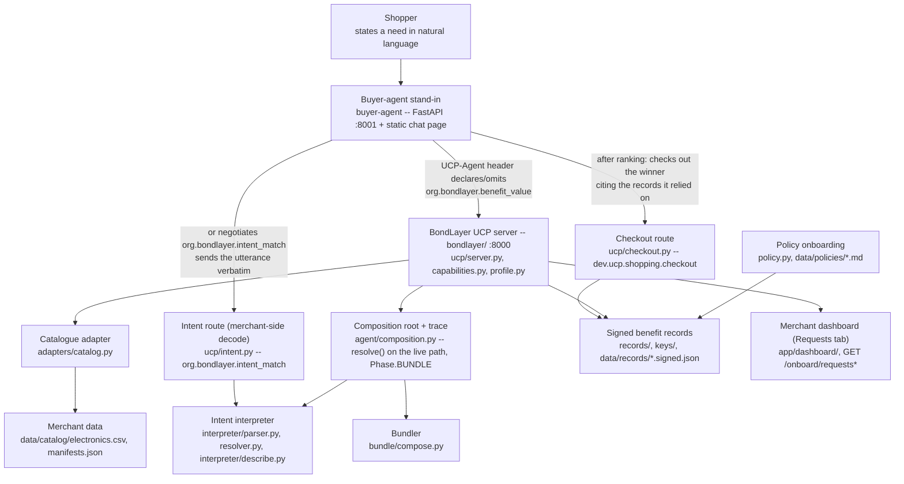

<!-- Root README. Written 12-13/09/2026 against round2/dev, re-verified sentence by
     sentence against the running code at 339a7ed on 13/09 (WS-D2 truth pass). Every
     figure below is copied from bondlayer/docs/eval-results.md at that commit or was
     reproduced by a command run in this worktree; nothing here is invented. The
     merchant-decode, checkout and close-the-loop passages (WS-J / WS-K / WS-L) were
     added on 13/09 against 66bb37c, each figure copied from a trace_run.py or
     TestClient run at that commit. Rulebook
     section references are to docs/Hackathon-Rulebook-2026-Final-Updated-1.pdf
     section C (Round 2 - 16-Hour Hackathon). -->

# BondLayer

**UAVS Hackathon 2026 · FPT Australasia — "The B2A Shift: Adapting Retail for AI Shopping Agents"**

## What this is, and why

Shopping agents are starting to do the comparing that used to happen in a human's head. They
read structured data, not sentiment: a price, a barcode, a hyperlink to a returns policy. A
retailer's real advantages — member pricing, free returns, a warranty that actually pays out,
a brand that repairs its own products — sit on the far side of that hyperlink, in prose a
machine cannot read, weigh, or verify. So an agent either ignores those facts or has to trust
an unverifiable feed, and a merchant that has built genuine loyalty value has no way to make
it legible at exactly the moment an agent is deciding who wins the sale.

BondLayer is a merchant-side layer that publishes a retailer's catalogue and policy facts as
the Universal Commerce Protocol (UCP) already expects to receive them — plus a signed
extension, `org.bondlayer.benefit_value`, that turns loyalty and service prose into typed,
verifiable, priced records attached to the catalogue call an agent already makes. Nothing is
installed on the agent side. An agent that does not know us gets plain, conformant UCP; an
agent that declares the extension gets the full offer, signed, with a stated ceiling on what
each claim is worth.

Two paths exist side by side, both negotiated capabilities on the same server, the same
merchants, the same signed records. The **publishing path** (`catalog.search` / `catalog.lookup`
plus `org.bondlayer.benefit_value`) is the default: the merchant publishes its shelf and its
signed facts, and the agent decodes the shopper's sentence, resolves it against what came back,
and ranks — the merchant never sees the utterance. The **intent path**
(`org.bondlayer.intent_match`, extending `catalog.search`, declared only by a merchant that also
publishes the benefit extension) is additive: an agent that negotiates it sends the shopper's
utterance verbatim, and the merchant decodes and resolves it on its own wire, returning
proposals with a per-constraint justification cited to its own records. Even there, the
shopper's valuation policy, benefit weights and the cross-merchant comparison never leave the
agent — only decoding moves merchant-side; verification, valuation and ranking stay
agent-side, so who wins is still the agent's own arithmetic.

The loop then closes. Once the agent has ranked, it checks out the offer it ranked first on
`dev.ucp.shopping.checkout` — base UCP, declared by every merchant — citing exactly the
signed records it relied on. The merchant re-judges each cited record on its own side and
binds the ones that hold into the order confirmation, as the same signed envelopes the
catalogue served, so the transaction carries proof of the benefits it was chosen for.
Payment is out of scope and the response says so: no funds move.

> In a room full of agents, we are building the thing agents read.

This is deliberately not a shopping assistant — the Problem Statement puts consumer-facing
agents out of scope, and this repository's own buyer-agent stand-in (`buyer-agent/`)
exists only to demonstrate the merchant side, never to be the product.

## Architecture



| Component | What it does | Path |
|---|---|---|
| Catalogue adapter | CSV export in, normalised `Sku` + `Diagnostic` out; repairs are logged, never silently applied | `bondlayer/src/bondlayer/adapters/catalog.py` |
| UCP head | `/.well-known/ucp` profile, capability negotiation, `catalog.search` / `catalog.lookup` for three merchants on one code path | `bondlayer/src/bondlayer/ucp/{profile,capabilities,server}.py` |
| Onboarding API | Merchant switcher, diagnostics report, CSV upload, `GET /onboard/requests` and `GET /onboard/requests/{id}` serving the eval runner's `RequestReport` JSON | `bondlayer/src/bondlayer/ucp/onboard.py` |
| Signed benefit records | ES256 detached signature over canonical JSON; a record is signed iff it carries both a signature and a key id | `bondlayer/src/bondlayer/records/`, `bondlayer/keys/`, `bondlayer/data/records/*.signed.json` |
| Policy onboarding | Merchant T&C/warranty/loyalty prose imported behind a human approval gate | `bondlayer/src/bondlayer/policy.py`, `bondlayer/data/policies/*.md` |
| Valuation | `credited = min(declared_ceiling, shopper_policy_value)`; zero for unsigned or unpriced claims | `bondlayer/src/bondlayer/valuation/` |
| Intent interpreter | Parses HARD / SOFT / SERVICE / VALUES clauses; `resolve()` runs on the live path (not a stub) and justifies each clause against catalogue attributes or verified records with a cited reason; `interpreter/describe.py` renders that same decode as JSON for the wire | `bondlayer/src/bondlayer/interpreter/{parser,resolver,describe}.py` |
| Merchant-side intent route | `POST /{merchant}/ucp/intent/propose` — the merchant receives the shopper's utterance verbatim, runs the same parser and resolver on its own wire, and returns `decoded_intent` plus `proposals` cited to its own verified records; negotiated as `org.bondlayer.intent_match`, declared only by a merchant that also publishes the benefit extension, 406 otherwise (and always on the control) | `bondlayer/src/bondlayer/ucp/intent.py` |
| Checkout route | `POST /{merchant}/ucp/checkout` — turns the chosen offer into an order confirmation (`status: confirmed_awaiting_payment`, `payment: {status: out_of_scope}`); with the benefit extension negotiated, returns one `honoured_benefits` verdict per cited record id (honoured only if published by this merchant, signed, unexpired, verifying against its own key and applying to a line item — otherwise the failing test in plain words) and the signed envelope of every honoured record. The server holds public keys only, so `order_id` is a deterministic content hash, not a new signature. 406 without the capability, 404 unknown SKU, 409 over published stock, 422 for any extra body field such as `shopper_policy` | `bondlayer/src/bondlayer/ucp/checkout.py` |
| Merchant decode, agent side | The buyer agent sends the same sentence to every merchant that negotiated `org.bondlayer.intent_match` and appends one trace step with each merchant's `decoded_intent`, its first five proposals and a clause-by-clause agreement check against the agent's own decode; never read by the ranking | `bondlayer/src/bondlayer/agent/merchant_decode.py` |
| Close the loop, agent side | After ranking, checks out one unit of the winner, citing exactly the verified records that moved its effective cost or answered a clause, and appends the merchant's confirmation as the last trace step; never changes the ranking, never cites an unverified record | `bondlayer/src/bondlayer/agent/close_loop.py` |
| Bundler | Composes already-matched proposals from one merchant into a set with a togetherness rationale; never re-matches, never crosses merchants; a bundle of one is the valid degenerate case | `bondlayer/src/bondlayer/bundle/compose.py` |
| Composition root + trace | Wires interpreter, merchants, valuation and the bundler into one request; renders the AI reasoning trace including the `Phase.RESOLVE` and `Phase.BUNDLE` steps | `bondlayer/src/bondlayer/agent/{composition,trace}.py` |
| Merchant dashboard | Onboarding screen, readiness (five dimensions, never averaged), a Requests tab rendering the four figures and "why we lost/won" per request from `/onboard/requests*` | `bondlayer/app/dashboard/` |
| Buyer-agent stand-in | The demo harness: turns a shopper's sentence into a UCP request against the running merchant server, shows the "Merchant's own reading" block between the trace and the ranking, and renders the checkout receipt last; static page only, no separate build step | `buyer-agent/src/agent/` |

`bondlayer/src/bondlayer/types.py` is the one shared contract every component above imports.
It is frozen on feature branches; a change goes to the team before it lands.

## Technologies, APIs, and every external resource (Rulebook §C.5.b)

Declared in full, as the rules require, so nothing here is an undisclosed dependency:

- **Python 3.12+** — the only runtime. `run.sh` refuses to start on an older interpreter.
- **FastAPI + uvicorn + pydantic** — the merchant server (`bondlayer/`) and the buyer-agent
  stand-in (`buyer-agent/`) are both FastAPI apps.
- **`cryptography`** — ES256 (P-256/SHA-256) detached signatures over canonical JSON for
  every benefit record. No key generation happens at runtime; keys ship from `bondlayer/keys/`
  and `bondlayer/keys/*.pem` is gitignored (private keys never enter the repository).
- **`httpx`**, **`python-multipart`**, **`pypdf`** — HTTP client for the agent-side fetcher,
  multipart uploads for the onboarding CSV route, and PDF reading for merchant policy
  documents respectively.
- **React, vendored as UMD builds** (`bondlayer/app/vendor/react.production.min.js`,
  `react-dom.production.min.js`) — the merchant dashboard. No build step, no npm dependency
  for the dashboard itself.
- **No separate chat UI build.** The buyer-agent stand-in serves one static page,
  `buyer-agent/src/agent/static/index.html`, from the agent's own FastAPI process on
  :8001. There is no Vite/TypeScript `src/ui/` in this build — an earlier draft of this
  README described one; it was deleted when the chat app was repointed at `bondlayer/`'s
  server, and nothing in `buyer-agent/` depends on `npm` or a dev server.
- **UCP (Universal Commerce Protocol), draft spec `2026-04-08`** — `catalog.search`,
  `catalog.lookup`, capability negotiation and the `signing_keys[]` key-publication mechanism
  are all UCP's own. Our extension is declared `org.bondlayer.benefit_value`, reverse-domain
  namespaced under `org.bondlayer.*` rather than `dev.ucp.*` because `dev.ucp.*` is reserved
  for capabilities governed by the UCP Tech Council itself (`bondlayer/docs/stage1-agent-ready-catalog.md`
  §5.6) — a third party may extend UCP only inside its own namespace.
- **OpenAI, optional, prose-only** — if `OPENAI_API_KEY` is set, the buyer-agent stand-in asks
  a model for one paragraph of rationale generated from the already-computed trace; if it is
  not set, a template sentence is rendered instead and the trace records
  `"prose: template (no model key)"`. No code path on the ranking or valuation side ever calls
  a model, and `buyer-agent/src/agent/llm.py` never raises for a missing key or a failed
  model call — both fall back to the template sentence.
- **No third-party dataset.** The electronics catalogue (`bondlayer/data/catalog/electronics.csv`),
  the three merchant manifests, the policy documents and the 30-request evaluation set are all
  synthetic, authored inside the competition window on 12/09/2026 from public product-page
  conventions, per assumption A1 in the submitted Round 1 proposal.
- **No network call at runtime.** `pip install` / `npm install` during setup are the only
  downloads; the demo runs entirely from seeded local state, because venue wifi is shared by
  twenty teams.

## Run it

One command from a clean clone:

```bash
./run.sh              # venv, install, merchant server :8000, agent :8001 (serves its own static page)
./run.sh --check       # venv, install, pytest -- what scripts/clean_clone_check.sh runs
./run.sh --setup       # install only, start nothing
./run.sh --no-agent    # merchant server only
```

Needs Python 3.12+ only; `PYTHON`, `BONDLAYER_PORT`, `AGENT_PORT` are the override
environment variables if the defaults (8000 / 8001) are already taken. `run.sh` also checks
for a `buyer-agent/src/ui` Vite dev server and a `UI_PORT` (5173) to serve it on, but that
directory does not exist in this build — the agent's own static page on :8001 is the only UI.
Idempotent — re-running reuses `.venv` and leaves an already-serving port alone.

**On Windows**, set `PYTHONUTF8=1` first (PowerShell: `$env:PYTHONUTF8 = "1"`). The trace
prints `←` and `✓`, which a default cp1252 console cannot encode: without it
`scripts/trace_run.py` raises `UnicodeEncodeError` and the eight tests that run it as a
subprocess fail. With it, `bondlayer/`'s suite is 270 passed at `66bb37c`.

**Manual path**, if you want the merchant server without the launcher:

```bash
cd bondlayer
pip install -e '.[dev]'
python run_server.py        # :8000, or the next free port if it is busy
pytest                       # bondlayer/'s own suite, offline
```

### The R01 demo script

R01 is the frozen request the proposal and the pitch both use: *"a laptop under $1,500 I can
return easily if it turns out not to suit my work, from a brand that actually repairs
things."* One hard price filter, one soft performance signal, one service constraint, one
values constraint — the four clause kinds in `bondlayer/data/eval/taxonomy.md`.

1. **Plain UCP — what every agent in the world does today.**
   ```bash
   curl "localhost:8000/voltway/ucp/catalog/search?category=laptop&max_price=1500"
   ```
   No `extensions` key in the response at all — absent, not empty.

2. **An agent that declares the extension.** Search itself must be negotiated the same way
   lookup is — declare both catalog capabilities plus the benefit extension in one header:
   ```bash
   curl -H "UCP-Agent: dev.ucp.shopping.catalog.search;dev.ucp.shopping.catalog.lookup;org.bondlayer.benefit_value" \
        "localhost:8000/voltway/ucp/catalog/search?category=laptop&max_price=1500"
   ```
   Same route, same response builder, same merchants. The only difference is that
   `extensions` now carries each product's benefit records, signed or not, each tagged
   `signed: bool`.

3. **The toggle, end to end.** Through the buyer-agent stand-in (`buyer-agent`) or
   `bondlayer/scripts/trace_run.py "a laptop under \$1,500 I can return easily if it turns out
   not to suit my work, from a brand that actually repairs things."` (`--control` for off),
   submit R01 with the BondLayer switch off, then on.
   - **On:** the trace's `[resolve: ok]` step reads `4 of 4 constraints answered; 2 answered
     only by a verified record.` Per constraint: the price and RAM/weight clauses resolve
     against catalogue attributes; the return-easily (SERVICE) and repairs-things (VALUES)
     clauses are each cited to a specific verified record on the winner, Voltway
     `VOL-0031` — `vw-returns-60` and `vw-repairability-parts-5y`. Voltway wins on effective
     cost **$933.01** against a $1,142.96 shelf price, never the cheapest shelf price anywhere
     in the catalogue, once those signed return-window, warranty and repairability records are
     credited under the shopper's own policy.
   - **Off (`--control`):** the trace's `[resolve: degraded]` step reads `2 of 4 constraints
     answered; 0 answered only by a verified record`, and the two unanswerable clauses each
     carry the marker `← no catalogue attribute answers this`. No merchant response in the log
     carries an `extensions` key. CityCircuit `CIT-0032` wins on shelf price alone at
     **$1,066.00** — cheapest shelf, no flip.
   - **The merchant's own reading.** With the switch on, the trace's `merchant decode (POST
     /ucp/intent/propose)` section shows what each merchant understood from the same
     sentence: Voltway and NorthGear each decode 4 constraints and agree with the agent 4/4
     (Voltway's first proposal answers 4/4 clauses; NorthGear's answers 3/4, unsatisfied on
     the repairs clause), and CityCircuit did not negotiate `org.bondlayer.intent_match`, so
     it decoded nothing. Off, the sentence is not sent at all. The ranking never reads this
     block — it is what the merchants proposed, not what the agent decided.
   - **The receipt.** The last section, `close the loop (POST /ucp/checkout)`, is the order
     the winner became. On: Voltway `VOL-0031`, `confirmed_awaiting_payment`, subtotal
     $1,142.96, **6/6 cited records honoured** and bound into the order (returns, warranty,
     points, member price, delivery, repairability). Off: CityCircuit `CIT-0032`, subtotal
     $1,066.00, a plain UCP order that binds no records. Both say payment is out of scope.

4. **The bundle.** `bondlayer/scripts/trace_run.py "Everything I need to start a podcast, under
   $1,200 all up"` composes a five-item Voltway set — microphone, headphones, interface, XLR
   cable, boom arm — at a combined shelf price of **$723.08**, with a togetherness rationale
   and each item's own cited notes underneath, rendered as a `Phase.BUNDLE` step in the trace.
   `bondlayer/docs/eval-results.md` scores this and one more bundle request (R06, R07) at 5/5
   of the frozen gold set; a third (R24, "a work laptop and a dock, under $2,200 together")
   composes 1 of 2 gold items because the frozen gold set names only laptops even though the
   request asks for a dock too — reported as a gold-set gap, not fitted around.

5. **The merchant-side intent route.** The same decode and match-with-justification can also
   run on the merchant's own wire instead of the agent's. Declare the extra capability:
   ```bash
   curl -X POST "localhost:8000/voltway/ucp/intent/propose" \
        -H "UCP-Agent: dev.ucp.shopping.catalog.search;dev.ucp.shopping.catalog.lookup;org.bondlayer.benefit_value;org.bondlayer.intent_match" \
        -H "Content-Type: application/json" \
        -d '{"utterance": "a laptop under $1,500 I can return easily if it turns out not to suit my work, from a brand that actually repairs things.", "limit": 5}'
   ```
   Voltway receives the utterance verbatim, decodes it with the same parser, and returns
   `decoded_intent` (the parsed constraints, what the catalogue cannot answer, and a clarifying
   question when nothing names a product) plus `proposals` cited to Voltway's own verified
   records — `evidence_record_id` / `evidence_attribute` / `note` per clause, exactly as the
   agent-side resolver reports them. `org.bondlayer.intent_match` is declared only by a merchant
   that also publishes the benefit extension; CityCircuit and any agent that omits the
   capability from its header get **406**. What never crosses this wire: the shopper's
   valuation policy, its benefit weights, or the cross-merchant comparison — those stay
   agent-side even here.

6. **Closing the loop by hand.** Check out the R01 winner, citing two of the records that
   answered its clauses plus one id Voltway never published:
   ```bash
   curl -X POST "localhost:8000/voltway/ucp/checkout" \
        -H "UCP-Agent: dev.ucp.shopping.catalog.search;dev.ucp.shopping.catalog.lookup;dev.ucp.shopping.checkout;org.bondlayer.benefit_value" \
        -H "Content-Type: application/json" \
        -d '{"items": [{"sku_id": "VOL-0031", "quantity": 1}], "cited_record_ids": ["vw-returns-60", "vw-repairability-parts-5y", "made-up-id"]}'
   ```
   The response carries `order` (`order_id`, `status: confirmed_awaiting_payment`, subtotal
   AUD 1142.96, `payment.status: out_of_scope`), `honoured_benefits` — `vw-returns-60` and
   `vw-repairability-parts-5y` honoured with the reason they hold, `made-up-id` refused as
   `not published by this merchant` — and `extensions` carrying the signed envelopes of the
   two honoured records. The same body twice gives the same `order_id`. Drop
   `dev.ucp.shopping.checkout` from the header and the call is **406**; add a
   `shopper_policy` field to the body and it is **422**, because the merchant must never
   receive it. The same call against CityCircuit returns a plain order with no
   `honoured_benefits` or `extensions` key.

7. **The tamper test.** Inflate an unsigned claim's declared value and re-run: ranking does
   not move, because an unsigned record is displayed and never credited, and a larger
   declared ceiling on a signed record is still only a ceiling — the shopper's own policy
   value caps it, so inflating it cannot buy rank either. Both are enforced as tests
   (`bondlayer/tests/test_invariants.py`), not asserted in a slide.

## Evaluation

**30 requests, frozen at 10:50 on 12/09 (`7b086bb`) before the enriched feed existed; one
gold-set correction at 13:16 (`5463287`).**

The table below is copied from `bondlayer/docs/eval-results.md` at commit `339a7ed`
(generated by `python scripts/eval_run.py` at `90de308`, re-verified byte-identical at
`339a7ed`), per the numbers policy: a figure appears here only if it exists in that file with
a commit hash, and only after it has been reproduced once. No number below is invented.
Reproduce with:

```bash
cd bondlayer && pip install -e '.[dev]' && pytest -q && python scripts/eval_run.py
```

| Metric | BondLayer | Control (no records) | Command | Commit |
|---|---|---|---|---|
| Hard precision (mean over 30) | 0.875 | — (control has no records to cite; it is scored the same way) | `python scripts/eval_run.py` | `339a7ed` |
| Gold recall (mean over 30) | 0.991 | — | — | `339a7ed` |
| Precision@\|gold\| (mean over 30) | 0.936 | — | — | `339a7ed` |
| Citation precision | 1.00 (154/154, must be 1.00) | n/a — nothing to cite | — | `339a7ed` |
| SERVICE + VALUES clauses answered | 15/18 (83%) | 0/18 (0%) | — | `339a7ed` |
| Requests expecting an unsatisfied clause that reported one | 2/2 | 2/2 | — | `339a7ed` |
| Decode precision (mean over 30) | 0.914 | — | — | `339a7ed` |
| Decode recall (mean over 30) | 0.972 | — | — | `339a7ed` |
| Kind confusions (total) | 2 | — | — | `339a7ed` |
| Perfect decodes (precision = recall = 1.00, no confusion) | 22/30 | — | — | `339a7ed` |

**The one number that matters** is the SERVICE + VALUES row: HARD and SOFT clauses resolve
identically whether or not records exist — a competent catalogue search handles price, RAM and
weight. The gap is entirely in SERVICE and VALUES, the clauses no product export has a column
for: 83% answered against 0%, because the control reports them honestly unsatisfied with the
marker `← no catalogue attribute answers this` rather than guessing.

**Bundle requests.** Three of the thirty requests have a *set* for a gold answer. R06 and R07
("everything to start a podcast" / "beginner-friendly podcasting gear") each compose 5/5 of
their frozen gold set from Voltway at a combined shelf price of $723.08. R24 ("a work laptop
and a dock, under $2,200 together") composes 1/2 — the frozen gold set names only laptops,
even though the request also asks for a dock, so the bundler's dock pick falls outside a gold
set that was never widened to match; reported as the gold set's own gap, not fitted around.

## Market strategy (25 points)

**Customer segment.** Mid-market retailers with a catalogue export and a policy PDF, no
integration team, and an existing loyalty program now exposed to a decision-maker it was
never built to persuade. The submitted proposal (`main.tex` §2.2) sizes this: for a retailer
with 100,000 members spending an average of $400/year, the 37% brand-switch-tolerance figure
(Accenture 2026) puts roughly $14.8m of annual revenue inside an agent's comparison each
year — currently undefended, because none of it is legible at the moment of comparison.

**Value model.** BondLayer is a hosted publishing layer, not a per-transaction toll: a
per-merchant subscription, priced on request volume and catalogue size rather than a share of
sales. The agent-side valuation logic is open, so the arithmetic behind a credited figure is
independently auditable rather than merchant-controlled — a merchant pays for legibility, not
for influence over the ranking.

**Competitive analysis.**

| | What it is | Journey stage | What it lacks against BondLayer |
|---|---|---|---|
| schema.org rich snippets (`MerchantReturnPolicy`, `ShippingDeliveryTime`) | A structured, real, widely-adopted baseline for returns and shipping metadata read by search engines and some agents | Discovery | No signing, no valuation, no warranty/trade-in/loyalty facts — and nothing equivalent exists for those at all today |
| Shopify's agentic storefront tooling | Platform-native product feeds and checkout surfaces for merchants already on Shopify | Discovery through checkout | Platform-coupled: no on-ramp for a retailer on a different stack; incentive and service facts are not typed or signed |
| Talon.One Unified Incentives Protocol (UIP) | Machine-readable loyalty/promotion data (balances, tiers, discounts) via MCP and UCP extensions, live for ~300 enterprise customers | Discovery, incentives only | No cryptographic verification; no valuation semantics (weighing left to the model); platform-coupled; no service facts (warranty, trade-in, repairs) |
| UCP Identity Linking | OAuth 2.0 account linking so a shopper's loyalty profile follows them into a transaction | Checkout, after the merchant is chosen | Preserves earned value; does not make it legible *before* the choice, which is the comparison BondLayer is built for |
| Raw UCP adoption (catalog + checkout, no extension) | The open protocol layer itself — free for any merchant to implement | Discovery through checkout | Answers "what do you sell" with a price and a barcode; carries no service or values facts at all, by the spec's own object model (`bondlayer/docs/stage1-agent-ready-catalog.md` §2) |

**Distribution.** Systems integrators already inside retail transformation work — FPT's own
retail delivery practice foremost — plus e-commerce agencies and, longer-term, a UCP
platform/app-store listing once the extension has adoption evidence behind it.

**Roadmap.** Pilot with one mid-market electronics retailer in shadow mode → protocol
certification against the UCP conformance suite → an agent-side SDK so a sceptical agent can
re-derive the arithmetic itself → propose `org.bondlayer.benefit_value` upstream to UCP as an
open contribution once real merchants have exercised it.

## Deployability and scale

BondLayer is a stateless publishing layer: it holds no per-shopper state and makes no
comparison decision, so it scales by **merchant count, not shopper count** — the merchant
never learns it was compared, and every response is cacheable, since a signed record is valid
until its stated `expires_at` regardless of who asks for it next. Cost per merchant is
dominated by catalogue and policy re-processing on ingest, not by serving traffic, which is
what makes it reachable by a mid-market retailer that cannot re-platform for every agent that
starts shopping its catalogue.

## Security and privacy

Every benefit record is signed (ES256 over canonical JSON) or explicitly marked unsigned —
`signed` is derived from the presence of a signature and key id, never authored. Unsigned
records are displayed, never credited: a record that cannot be verified cannot move a
ranking. Public keys are published in `/.well-known/ucp`'s `signing_keys[]`; private keys
never leave `bondlayer/keys/` and are gitignored. The shopper's valuation policy — what a
benefit is worth to them, what premium they will tolerate — stays in the agent and is never
sent to a merchant, so no merchant can price against it. That holds at checkout too: the
merchant receives SKU ids, quantities and the record ids the agent cited, and the request
model rejects any extra field (a `shopper_policy` key is a 422, not a silently ignored leak).
An order binds only records the merchant can re-verify against its own published key. No PII travels on the wire in this
prototype: Round 2 uses synthetic member data only, matching assumption A7 in the submitted
proposal.

## Problem Setter input

The questions put to FPT in the 15:30 window, Ford's answers, the concrete change each one
caused, and the adaptations made from the team's own re-reading of the full case study were
recorded in `docs/notes/PROBLEM-SETTER-NOTES.md`. That note was removed from the tree in the
13/09 cleanup and is kept in git history (`git show 074e51c:docs/notes/PROBLEM-SETTER-NOTES.md`);
both count toward the Round 2 "Adaptation & upgrade" criterion (10 points).

## Deliberately not attempted

Real payment flows (checkout confirms an order and binds its benefits, but
`payment.status` is `out_of_scope` and no funds move; there is no order store, cart or order
management) · production authentication · live merchant integration · protocol
certification · the negotiation / counter-offer protocol (named as an illustrative direction,
not a requirement; reversing the decision to drop it is Ford's call, not a technical one) ·
the 100+ request evaluation set promised in the submitted proposal's §6 Phase 4 — we ship 30,
frozen before the enriched feed existed, because a smaller honest number with a stated method
beats a larger one nobody on the team can defend in Q&A.

## Repo map

```
bondlayer/          the product -- merchant-side UCP server, adapter, signed records,
                     valuation, intent interpreter, composition root, dashboard
buyer-agent/         the buyer-agent stand-in used in the demo -- not the product
docs/notes/          working notes: the Day 2 plan and pitch outline
docs/                problem statement, rulebook, team crosswalk, this README's sources
scripts/             scripts/clean_clone_check.sh -- the clean-clone verification WS-C built
run.sh, run.ps1      one command from a clean clone to the running demo
```

Two Round 1 feasibility spikes used to sit in `archive/pre-hackathon-spikes/`: `bach-demo/`,
committed 02/09/2026, and `demo/`, committed 12/09/2026 at 09:45 — 45 minutes after the
09:00 Hackathon code cutoff, and declared pre-work in its own `DECISIONS.md` rather than
submission code. **No submitted code imported from either folder.** Both, with
`archive/README.md` (the grep that checked this and what each spike contributed), were removed
from the tree in the 13/09 cleanup and remain in git history at commit `074e51c`.

## Team

| Full name | Role | University |
|---|---|---|
| Hoang Manh Nguyen | Software Engineer | University of Wollongong |
| Thanh Nha Phan | Product Manager | University of Wollongong |
| Minh Hieu Tran | ML Engineer | University of Wollongong |
| Thanh Bach Ly | Software Engineer | University of Wollongong |
| Ha Anh Minh Truong | UX/UI Designer | University of Wollongong |

Team block per the submitted Round 1 proposal (`main.tex`), the source of truth for names,
roles and university. See [`docs/team.md`](docs/team.md) for the crosswalk between these
names, the handover document's nicknames, and the Round 2 git branches.

## Sources

Harvard style, per the submitted proposal's own convention. Magentic Marketplace is always
cited as a preprint, never as peer-reviewed.

Accenture 2026, *Talk to my AI agent: the new rules of brand value*, viewed 29 August 2026,
<https://www.accenture.com/us-en/insights/consulting/talk-my-ai-agent>. · Australia Post 2026,
*Australia Post eCommerce Report 2026*, viewed 29 August 2026,
<https://auspost.com.au/business/ecommerce/ecommerce-report>. · Bansal, G. et al. 2025,
*Magentic Marketplace: an open-source environment for studying agentic markets*, arXiv
preprint, viewed 29 August 2026, <https://arxiv.org/abs/2510.25779>. · Google 2026a, *AI
shopping gets simpler with Universal Commerce Protocol updates*, viewed 30 August 2026,
<https://blog.google/products-and-platforms/products/shopping/ucp-updates/>. · Google 2026b,
*How we're helping retailers thrive with new Universal Commerce Protocol features and AI
tools on Google*, viewed 29 August 2026,
<https://blog.google/products-and-platforms/products/shopping/shopping-updates-google-marketing-live/>. ·
Salesforce 2025, *Consumers are ready for AI agents. Are businesses?*, viewed 29 August 2026,
<https://www.salesforce.com/news/stories/consumers-ready-for-ai-agents-research/>. · Talon.One
2026a, *Talon.One announces Unified Incentives Protocol*, Business Wire, viewed 30 August
2026,
<https://www.businesswire.com/news/home/20260128078022/en/Talon.One-Announces-Unified-Incentives-Protocol-to-Power-Loyalty-and-Promotions-in-Agentic-Commerce>. ·
Talon.One 2026b, *Introducing the Unified Incentives Protocol*, viewed 1 September 2026,
<https://www.talon.one/blog/introducing-the-unified-incentives-protocol>. · Universal Commerce
Protocol 2026, *Loyalty Extension* and *Signatures*, viewed 29 August 2026,
<https://ucp.dev/draft/specification/common/extensions/loyalty/>,
<https://ucp.dev/2026-04-08/specification/signatures/>. · UAVS-NSW 2026, UAVS Hackathon 2026 —
workshop insights and Round 1 proposal notes, internal document distributed to registered
teams by the Organising Committee.
