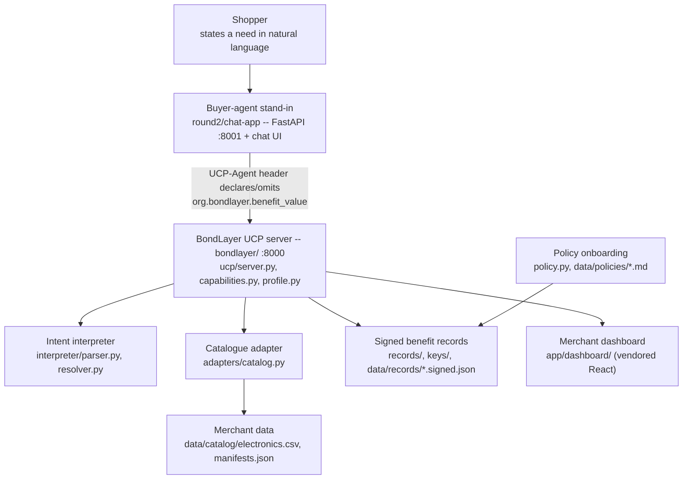

<!-- Root README. Written 12-13/09/2026 against round2/dev at 47cd125 and re-verified
     against the running code where marked. Sentences describing work still in flight on
     WS-A / WS-B / WS-C at the time of writing carry <!-- VERIFY 13/09 --> and name what
     they depend on. Rulebook section references are to docs/Hackathon-Rulebook-2026-Final-Updated-1.pdf
     section C (Round 2 - 16-Hour Hackathon). -->

# BondLayer

**UAVS Hackathon 2026 · FPT Australasia — "The B2A Shift: Adapting Retail for AI Shopping Agents"**

## What this is, and why

Shopping agents are starting to do the comparing that used to happen in a human's head. They
read structured data, not sentiment: a price, a barcode, a hyperlink to a returns policy. A
retailer's real advantages — member pricing, free returns, a warranty that actually pays out,
a brand that repairs its own products — sit on the far side of that hyperlink, in prose a
machine cannot read, weigh, or verify. So an agent either ignores those facts or has to trust
an unverifiable feed, and a merchant that has built genuine loyalty value has no way to make
it legible at exactly the moment an agent is deciding who wins the sale.

BondLayer is a merchant-side layer that publishes a retailer's catalogue and policy facts as
the Universal Commerce Protocol (UCP) already expects to receive them — plus a signed
extension, `org.bondlayer.benefit_value`, that turns loyalty and service prose into typed,
verifiable, priced records attached to the catalogue call an agent already makes. Nothing is
installed on the agent side. An agent that does not know us gets plain, conformant UCP; an
agent that declares the extension gets the full offer, signed, with a stated ceiling on what
each claim is worth.

> In a room full of agents, we are building the thing agents read.

This is deliberately not a shopping assistant — the Problem Statement puts consumer-facing
agents out of scope, and this repository's own buyer-agent stand-in (`round2/chat-app/`)
exists only to demonstrate the merchant side, never to be the product.

## Architecture



| Component | What it does | Path |
|---|---|---|
| Catalogue adapter | CSV export in, normalised `Sku` + `Diagnostic` out; repairs are logged, never silently applied | `bondlayer/src/bondlayer/adapters/catalog.py` |
| UCP head | `/.well-known/ucp` profile, capability negotiation, `catalog.search` / `catalog.lookup` for three merchants on one code path | `bondlayer/src/bondlayer/ucp/{profile,capabilities,server}.py` |
| Onboarding API | Merchant switcher, diagnostics report, CSV upload | `bondlayer/src/bondlayer/ucp/onboard.py` |
| Signed benefit records | ES256 detached signature over canonical JSON; a record is signed iff it carries both a signature and a key id | `bondlayer/src/bondlayer/records/`, `bondlayer/keys/`, `bondlayer/data/records/*.signed.json` |
| Policy onboarding | Merchant T&C/warranty/loyalty prose imported behind a human approval gate | `bondlayer/src/bondlayer/policy.py`, `bondlayer/data/policies/*.md` |
| Valuation | `credited = min(declared_ceiling, shopper_policy_value)`; zero for unsigned or unpriced claims | `bondlayer/src/bondlayer/valuation/` |
| Intent interpreter | Parses HARD / SOFT / SERVICE / VALUES clauses; resolves each against catalogue attributes or verified records with a cited reason | `bondlayer/src/bondlayer/interpreter/{parser,resolver}.py` <!-- VERIFY 13/09: resolver.py is WS-A's in-flight work; parser.py is landed --> |
| Composition root + trace | Wires interpreter, merchants and valuation into one request; renders the AI reasoning trace | `bondlayer/src/bondlayer/agent/{composition,trace}.py` |
| Merchant dashboard | Onboarding screen, readiness (five dimensions, never averaged), per-request "why we lost" | `bondlayer/app/dashboard/` |
| Buyer-agent stand-in | The demo harness: turns a shopper's sentence into a UCP request against the running merchant server | `round2/chat-app/src/agent/` <!-- VERIFY 13/09: WS-B is deleting src/merchant/ and data/ and repointing ucp_client.py at BONDLAYER_MERCHANT_URL; as of this commit MERCHANT_BASE_URL is still hardcoded to 127.0.0.1:8000 rather than read from that env var --> |

`bondlayer/src/bondlayer/types.py` is the one shared contract every component above imports.
It is frozen on feature branches; a change goes to the team before it lands.

## Technologies, APIs, and every external resource (Rulebook §C.5.b)

Declared in full, as the rules require, so nothing here is an undisclosed dependency:

- **Python 3.12+** — the only runtime. `run.sh` refuses to start on an older interpreter.
- **FastAPI + uvicorn + pydantic** — the merchant server (`bondlayer/`) and the buyer-agent
  stand-in (`round2/chat-app/`) are both FastAPI apps.
- **`cryptography`** — ES256 (P-256/SHA-256) detached signatures over canonical JSON for
  every benefit record. No key generation happens at runtime; keys ship from `bondlayer/keys/`
  and `bondlayer/keys/*.pem` is gitignored (private keys never enter the repository).
- **`httpx`**, **`python-multipart`**, **`pypdf`** — HTTP client for the agent-side fetcher,
  multipart uploads for the onboarding CSV route, and PDF reading for merchant policy
  documents respectively.
- **React, vendored as UMD builds** (`bondlayer/app/vendor/react.production.min.js`,
  `react-dom.production.min.js`) — the merchant dashboard. No build step, no npm dependency
  for the dashboard itself.
- **Vite + TypeScript** — the buyer-agent stand-in's optional chat UI (`round2/chat-app/src/ui/`),
  served on :5173 when `npm` is present; `run.sh` falls back to the agent's own static page on
  :8001 when it is not. <!-- VERIFY 13/09: confirm WS-B keeps the Vite UI rather than folding it into the agent's static page -->
- **UCP (Universal Commerce Protocol), draft spec `2026-04-08`** — `catalog.search`,
  `catalog.lookup`, capability negotiation and the `signing_keys[]` key-publication mechanism
  are all UCP's own. Our extension is declared `org.bondlayer.benefit_value`, reverse-domain
  namespaced under `org.bondlayer.*` rather than `dev.ucp.*` because `dev.ucp.*` is reserved
  for capabilities governed by the UCP Tech Council itself (`bondlayer/docs/stage1-agent-ready-catalog.md`
  §5.6) — a third party may extend UCP only inside its own namespace.
- **OpenAI, optional, prose-only** — if `OPENAI_API_KEY` is set, the buyer-agent stand-in asks
  a model for one paragraph of rationale generated from the already-computed trace; if it is
  not set, a template sentence is rendered instead and the trace records
  `"prose: template (no model key)"`. No code path on the ranking or valuation side ever calls
  a model, and no code path raises for a missing key. <!-- VERIFY 13/09: round2/chat-app/src/agent/llm.py currently raises LLMUnavailable when OPENAI_API_KEY is missing; WS-B's D4 ruling (never raise, template fallback) is not yet landed in this commit -->
- **No third-party dataset.** The electronics catalogue (`bondlayer/data/catalog/electronics.csv`),
  the three merchant manifests, the policy documents and the 30-request evaluation set are all
  synthetic, authored inside the competition window on 12/09/2026 from public product-page
  conventions, per assumption A1 in the submitted Round 1 proposal.
- **No network call at runtime.** `pip install` / `npm install` during setup are the only
  downloads; the demo runs entirely from seeded local state, because venue wifi is shared by
  twenty teams.

## Run it

One command from a clean clone:

```bash
./run.sh              # venv, install, merchant server :8000, agent :8001 (+ Vite UI :5173 if npm present)
./run.sh --check       # venv, install, pytest -- what scripts/clean_clone_check.sh runs
./run.sh --setup       # install only, start nothing
./run.sh --no-agent    # merchant server only
```

Needs Python 3.12+ only; `PYTHON`, `BONDLAYER_PORT`, `AGENT_PORT`, `UI_PORT` are the override
environment variables if the defaults (8000 / 8001 / 5173) are already taken. Idempotent —
re-running reuses `.venv` and leaves an already-serving port alone.

**Manual path**, if you want the merchant server without the launcher:

```bash
cd bondlayer
pip install -e '.[dev]'
python run_server.py        # :8000, or the next free port if it is busy
pytest                       # bondlayer/'s own suite, offline
```

### The R01 demo script

R01 is the frozen request the proposal and the pitch both use: *"a laptop under $1,500 I can
return easily if it turns out not to suit my work, from a brand that actually repairs
things."* One hard price filter, one soft performance signal, one service constraint, one
values constraint — the four clause kinds in `bondlayer/data/eval/taxonomy.md`.

1. **Plain UCP — what every agent in the world does today.**
   ```bash
   curl "localhost:8000/voltway/ucp/catalog/search?category=laptop&max_price=1500"
   ```
   No `extensions` key in the response at all — absent, not empty.

2. **An agent that declares the extension.** Search itself must be negotiated the same way
   lookup is — declare both catalog capabilities plus the benefit extension in one header:
   ```bash
   curl -H "UCP-Agent: dev.ucp.shopping.catalog.search;dev.ucp.shopping.catalog.lookup;org.bondlayer.benefit_value" \
        "localhost:8000/voltway/ucp/catalog/search?category=laptop&max_price=1500"
   ```
   Same route, same response builder, same merchants. The only difference is that
   `extensions` now carries each product's benefit records, signed or not, each tagged
   `signed: bool`.

3. **The toggle, end to end.** Through the buyer-agent stand-in (`round2/chat-app`), submit
   R01 with the BondLayer switch off, then on. Off: cheapest shelf price wins, and no
   merchant response in the log carries an `extensions` key. On: Voltway — never the
   cheapest shelf price anywhere in the catalogue — wins on effective cost once its signed
   return-window, warranty and repairability records are credited under the shopper's own
   policy. <!-- VERIFY 13/09: depends on WS-B Part 2 and WS-A's resolver landing; the fallback is bondlayer/scripts/trace_run.py, WS-B's Path-B demo, if the chat app is not green by the freeze -->

4. **The tamper test.** Inflate an unsigned claim's declared value and re-run: ranking does
   not move, because an unsigned record is displayed and never credited, and a larger
   declared ceiling on a signed record is still only a ceiling — the shopper's own policy
   value caps it, so inflating it cannot buy rank either. Both are enforced as tests
   (`bondlayer/tests/test_invariants.py`), not asserted in a slide.

## Evaluation

**30 requests, frozen at 10:50 on 12/09 (`7b086bb`) before the enriched feed existed; one
gold-set correction at 13:16 (`5463287`).**

The table below is a placeholder. It is filled from `bondlayer/docs/eval-results.md` at the
11:30 run, per the numbers policy: a figure appears here only if it exists in that file with
a commit hash, and only after it has been reproduced once. No number below is invented.

| Metric | BondLayer | Control (CityCircuit) | Command | Commit |
|---|---|---|---|---|
| Hard precision | pending `eval-results.md` | pending | `python scripts/eval_run.py` | pending |
| Gold recall | pending | pending | — | pending |
| Citation precision | pending (must be 1.00) | pending | — | pending |
| Unsatisfied honesty | pending | pending | — | pending |
| Answerable share (SERVICE + VALUES) | pending | pending (near 0 expected) | — | pending |

<!-- VERIFY 13/09: replace this whole table from bondlayer/docs/eval-results.md once WS-A's
     scripts/eval_run.py has run on merged round2/dev; do not hand-fill any cell before then. -->

## Market strategy (25 points)

**Customer segment.** Mid-market retailers with a catalogue export and a policy PDF, no
integration team, and an existing loyalty program now exposed to a decision-maker it was
never built to persuade. The submitted proposal (`main.tex` §2.2) sizes this: for a retailer
with 100,000 members spending an average of $400/year, the 37% brand-switch-tolerance figure
(Accenture 2026) puts roughly $14.8m of annual revenue inside an agent's comparison each
year — currently undefended, because none of it is legible at the moment of comparison.

**Value model.** BondLayer is a hosted publishing layer, not a per-transaction toll: a
per-merchant subscription, priced on request volume and catalogue size rather than a share of
sales. The agent-side valuation logic is open, so the arithmetic behind a credited figure is
independently auditable rather than merchant-controlled — a merchant pays for legibility, not
for influence over the ranking.

**Competitive analysis.**

| | What it is | Journey stage | What it lacks against BondLayer |
|---|---|---|---|
| schema.org rich snippets (`MerchantReturnPolicy`, `ShippingDeliveryTime`) | A structured, real, widely-adopted baseline for returns and shipping metadata read by search engines and some agents | Discovery | No signing, no valuation, no warranty/trade-in/loyalty facts — and nothing equivalent exists for those at all today |
| Shopify's agentic storefront tooling | Platform-native product feeds and checkout surfaces for merchants already on Shopify | Discovery through checkout | Platform-coupled: no on-ramp for a retailer on a different stack; incentive and service facts are not typed or signed |
| Talon.One Unified Incentives Protocol (UIP) | Machine-readable loyalty/promotion data (balances, tiers, discounts) via MCP and UCP extensions, live for ~300 enterprise customers | Discovery, incentives only | No cryptographic verification; no valuation semantics (weighing left to the model); platform-coupled; no service facts (warranty, trade-in, repairs) |
| UCP Identity Linking | OAuth 2.0 account linking so a shopper's loyalty profile follows them into a transaction | Checkout, after the merchant is chosen | Preserves earned value; does not make it legible *before* the choice, which is the comparison BondLayer is built for |
| Raw UCP adoption (catalog + checkout, no extension) | The open protocol layer itself — free for any merchant to implement | Discovery through checkout | Answers "what do you sell" with a price and a barcode; carries no service or values facts at all, by the spec's own object model (`bondlayer/docs/stage1-agent-ready-catalog.md` §2) |

**Distribution.** Systems integrators already inside retail transformation work — FPT's own
retail delivery practice foremost — plus e-commerce agencies and, longer-term, a UCP
platform/app-store listing once the extension has adoption evidence behind it.

**Roadmap.** Pilot with one mid-market electronics retailer in shadow mode → protocol
certification against the UCP conformance suite → an agent-side SDK so a sceptical agent can
re-derive the arithmetic itself → propose `org.bondlayer.benefit_value` upstream to UCP as an
open contribution once real merchants have exercised it.

## Deployability and scale

BondLayer is a stateless publishing layer: it holds no per-shopper state and makes no
comparison decision, so it scales by **merchant count, not shopper count** — the merchant
never learns it was compared, and every response is cacheable, since a signed record is valid
until its stated `expires_at` regardless of who asks for it next. Cost per merchant is
dominated by catalogue and policy re-processing on ingest, not by serving traffic, which is
what makes it reachable by a mid-market retailer that cannot re-platform for every agent that
starts shopping its catalogue.

## Security and privacy

Every benefit record is signed (ES256 over canonical JSON) or explicitly marked unsigned —
`signed` is derived from the presence of a signature and key id, never authored. Unsigned
records are displayed, never credited: a record that cannot be verified cannot move a
ranking. Public keys are published in `/.well-known/ucp`'s `signing_keys[]`; private keys
never leave `bondlayer/keys/` and are gitignored. The shopper's valuation policy — what a
benefit is worth to them, what premium they will tolerate — stays in the agent and is never
sent to a merchant, so no merchant can price against it. No PII travels on the wire in this
prototype: Round 2 uses synthetic member data only, matching assumption A7 in the submitted
proposal.

## Problem Setter input

See [`round2/PROBLEM-SETTER-NOTES.md`](round2/PROBLEM-SETTER-NOTES.md) for the questions put
to FPT in the 15:30 window, Ford's answers, and the concrete change each one caused. The
adaptations made from the team's own re-reading of the full case study — ahead of and
independent of that window — are recorded there too, since both count toward the Round 2
"Adaptation & upgrade" criterion (10 points).

## Deliberately not attempted

Real payment flows · production authentication · live merchant integration · protocol
certification · the negotiation / counter-offer protocol (named as an illustrative direction,
not a requirement; reversing the decision to drop it is Ford's call, not a technical one) ·
the 100+ request evaluation set promised in the submitted proposal's §6 Phase 4 — we ship 30,
frozen before the enriched feed existed, because a smaller honest number with a stated method
beats a larger one nobody on the team can defend in Q&A. Dynamic bundling is scoped as a
best-effort addition (`Bundler` on `types.py`); a bundle of one SKU is a valid degenerate case
if it does not land in full. <!-- VERIFY 13/09: state final bundling status once WS-G's time box closes -->

## Repo map

```
bondlayer/          the product -- merchant-side UCP server, adapter, signed records,
                     valuation, intent interpreter, composition root, dashboard
round2/chat-app/     the buyer-agent stand-in used in the demo -- not the product
round2/              working notes, the Day 2 plan, this repository's own docs
archive/             pre-hackathon reference material -- see below
docs/                problem statement, rulebook, team crosswalk, this README's sources
scripts/             scripts/clean_clone_check.sh -- the clean-clone verification WS-C built
run.sh, run.ps1      one command from a clean clone to the running demo
```

`archive/pre-hackathon-spikes/` holds two Round 1 feasibility spikes, kept for reference
only: `bach-demo/`, committed 02/09/2026, and `demo/`, committed 12/09/2026 at 09:45 — 45
minutes after the 09:00 Hackathon code cutoff, and declared pre-work in its own `DECISIONS.md`
rather than submission code. **No submitted code imports from either folder** — see
`archive/README.md` for the grep that checks this and what each spike's specification, data
design and demo-script ideas contributed, re-derived and re-implemented inside the
competition window, to the product that actually shipped.

## Team

| Full name | Role | University |
|---|---|---|
| Hoang Manh Nguyen | Software Engineer | University of Wollongong |
| Thanh Nha Phan | Product Manager | University of Wollongong |
| Minh Hieu Tran | ML Engineer | University of Wollongong |
| Thanh Bach Ly | Software Engineer | University of Wollongong |
| Ha Anh Minh Truong | UX/UI Designer | University of Wollongong |

Team block per the submitted Round 1 proposal (`main.tex`), the source of truth for names,
roles and university. See [`docs/team.md`](docs/team.md) for the crosswalk between these
names, the handover document's nicknames, and the Round 2 git branches.

## Sources

Harvard style, per the submitted proposal's own convention. Magentic Marketplace is always
cited as a preprint, never as peer-reviewed.

Accenture 2026, *Talk to my AI agent: the new rules of brand value*, viewed 29 August 2026,
<https://www.accenture.com/us-en/insights/consulting/talk-my-ai-agent>. · Australia Post 2026,
*Australia Post eCommerce Report 2026*, viewed 29 August 2026,
<https://auspost.com.au/business/ecommerce/ecommerce-report>. · Bansal, G. et al. 2025,
*Magentic Marketplace: an open-source environment for studying agentic markets*, arXiv
preprint, viewed 29 August 2026, <https://arxiv.org/abs/2510.25779>. · Google 2026a, *AI
shopping gets simpler with Universal Commerce Protocol updates*, viewed 30 August 2026,
<https://blog.google/products-and-platforms/products/shopping/ucp-updates/>. · Google 2026b,
*How we're helping retailers thrive with new Universal Commerce Protocol features and AI
tools on Google*, viewed 29 August 2026,
<https://blog.google/products-and-platforms/products/shopping/shopping-updates-google-marketing-live/>. ·
Salesforce 2025, *Consumers are ready for AI agents. Are businesses?*, viewed 29 August 2026,
<https://www.salesforce.com/news/stories/consumers-ready-for-ai-agents-research/>. · Talon.One
2026a, *Talon.One announces Unified Incentives Protocol*, Business Wire, viewed 30 August
2026,
<https://www.businesswire.com/news/home/20260128078022/en/Talon.One-Announces-Unified-Incentives-Protocol-to-Power-Loyalty-and-Promotions-in-Agentic-Commerce>. ·
Talon.One 2026b, *Introducing the Unified Incentives Protocol*, viewed 1 September 2026,
<https://www.talon.one/blog/introducing-the-unified-incentives-protocol>. · Universal Commerce
Protocol 2026, *Loyalty Extension* and *Signatures*, viewed 29 August 2026,
<https://ucp.dev/draft/specification/common/extensions/loyalty/>,
<https://ucp.dev/2026-04-08/specification/signatures/>. · UAVS-NSW 2026, UAVS Hackathon 2026 —
workshop insights and Round 1 proposal notes, internal document distributed to registered
teams by the Organising Committee.
