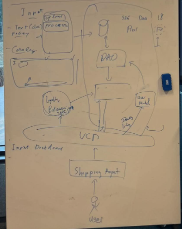
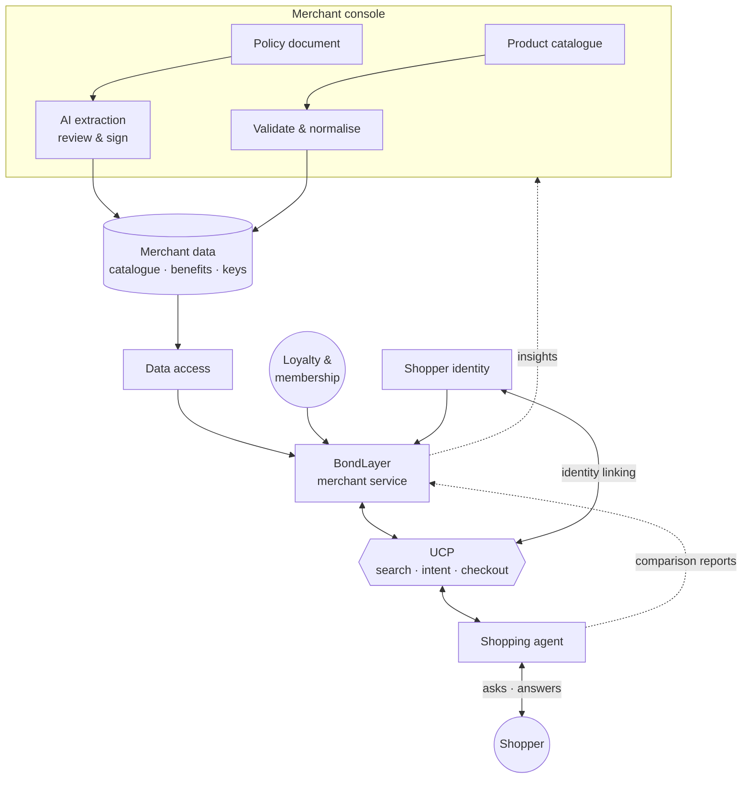

# BondLayer

**Helping retailers win when AI agents do the shopping.**
*UAVS Hackathon 2026 · FPT Australasia · The B2A Shift*

**Live website:** 

[Merchant console](https://bondlayer-merchant.fly.dev/console/)

[Customer Shopping chatbot](https://bondlayer-agent.fly.dev/)

## The problem

Shoppers are starting to hand their shopping to AI agents: *"find me a laptop under $1,500
that's easy to return."* An agent compares stores on what it can read: price, specs and
stock. But what makes a store worth choosing, such as a 60-day return window, a longer
warranty, loyalty points or a repair service, is buried in policy pages the agent can't
read or trust. So the store with the better offer can still lose to the one with the lower
sticker price.

## The idea

BondLayer is the layer a retailer puts in front of AI agents. It turns what the merchant
already has, a product spreadsheet and a policy document, into data an agent can read
**and verify**: a clean catalogue, plus **signed benefit records** that state each benefit,
its conditions and its maximum value. It speaks the Universal Commerce Protocol (UCP), so
any compatible agent can use it without custom integration.

## Features

- **Guided onboarding:** upload a product CSV, preview a readiness score and publish in three steps.
- **Catalogue checks:** messy fields are fixed automatically, and the top issues come with what to do.
- **AI policy extraction:** returns, warranty and loyalty terms become draft benefits for the merchant to review.
- **Signed benefit records:** approved benefits are signed (ES256) so agents can verify who published them.
- **UCP publishing:** catalogue search, intent matching and checkout for any compatible shopping agent.
- **Shopping insights:** a dashboard of shopper demand, agent outcomes, benefit recognition and next improvements.
- **Ask BondLayer:** ask questions about your catalogue in plain language.

## How it helps a merchant

| Step | The merchant… | BondLayer… |
|---|---|---|
| 1. Onboard | uploads a product CSV | fixes messy fields and shows which issues hide products from agents |
| 2. Publish benefits | uploads a returns, warranty or loyalty policy | extracts each benefit with AI; the merchant reviews, signs and publishes |
| 3. Get compared | does nothing | serves the catalogue and signed benefits when agents search |
| 4. Improve | opens Shopping insights | shows what shoppers asked for, when agents chose the store, and what to fix next |

Agents stay in control: they check every signature, credit a benefit only up to what it is
worth to *their* shopper, and ignore anything unsigned — so a merchant can't buy rank
with inflated claims.

## Does it work?

On our demo request — *"a laptop under $1,500 I can return easily, from a brand that
actually repairs things"* — the result flips once benefits are readable:

| | Without BondLayer | With BondLayer |
|---|---|---|
| Shopper needs answered | 2 of 4 | 4 of 4 |
| Agent's pick | cheapest shelf price ($1,066) | better overall offer ($933 after benefits) |

Across 30 test requests, service and values needs answered rose from **0% to 83%**
([evaluation](bondlayer/docs/eval-results.md)).

## Architecture

We sketched the system on a whiteboard first; the diagram beside it is the same shape,
traced through the components we built. Merchant inputs are processed and stored, a data
layer feeds the merchant service alongside loyalty and shopper identity, and everything an
agent needs crosses a single UCP layer — with each comparison flowing back to the merchant
as insight.

<table>
<tr>
<th>Whiteboard sketch</th>
<th>System flow</th>
</tr>
<tr>
<td width="38%" valign="top"></td>
<td width="62%" valign="top">



</td>
</tr>
</table>

## Build it locally


**Locally** (Python 3.12+; copy `.env.example` to `.env` and add `OPENAI_API_KEY`):

```bash
./run.sh          # Windows: $env:PYTHONUTF8="1"; .\run.ps1
```

Then open http://127.0.0.1:8000/console/ (merchant) and http://127.0.0.1:8001/ (agent).
Add `BONDLAYER_DEMO_DATA=1` to `.env` to preload demo stores.
Deployment: [docs/deploy-fly.md](docs/deploy-fly.md).

Built with Python/FastAPI, Next.js, OpenAI and ES256 signatures.
Team: Hoang Manh Nguyen, Thanh Nha Phan, Minh Hieu Tran, Thanh Bach Ly, Ha Anh Minh Truong
(University of Wollongong). [MIT License](LICENSE).
