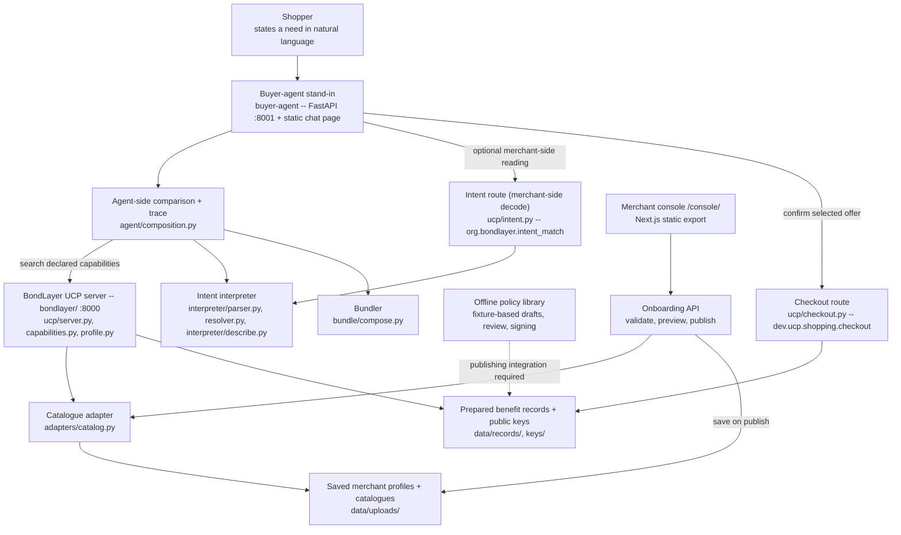

# BondLayer

**Help AI shopping assistants understand your products and the benefits of buying from your store.**

**UAVS Hackathon 2026 · FPT Australasia — "The B2A Shift: Adapting Retail for AI Shopping Agents"**

## What this is, and why

BondLayer is for **retailers**. Start with a product spreadsheet: BondLayer checks it,
standardises supported fields, explains data problems and publishes a catalogue that
compatible shopping assistants can search.

A **shopping agent** is software that finds and compares products on a shopper's behalf.
Price alone does not tell it the whole story. Your store might offer easier returns, a
longer warranty or a useful loyalty programme. BondLayer's benefit-record system lets a
compatible agent inspect those advantages while choosing an offer, with conditions and
evidence attached.

For example, a shopper asks for **"a laptop under $1,500 that is easy to return."** Product
data answers the price question. A published returns record can answer the service question.
The shopping agent decides how much that benefit matters to its shopper.

> In a room full of agents, we are building the thing agents read.

**Start here:** [Run it](#run-it) → [Onboard your store](#onboard-your-store) →
[Understand your report](#understand-your-report) → [Try a shopping request](#try-a-shopping-request).

**Learn more:** [Policies and benefits](#policies-and-benefits) · [What is UCP?](#what-is-ucp) ·
[Troubleshooting](#troubleshooting) · [Architecture](#architecture) · [Evaluation](#evaluation).

### What works in this prototype

| Feature | Current behaviour |
|---|---|
| New merchant onboarding | Enter business details, upload a CSV, preview the report and publish. |
| Catalogue checks and publishing | Accepted products are searchable; diagnostics explain repairs and remaining issues. |
| Saved merchant data | Published profiles and catalogues load again after a server restart. A fresh installation starts empty. |
| Buyer-agent demonstration | Discovers merchants on the local server and compares their uploaded products. |
| Policy extraction and approval | An offline library uses prepared extraction fixtures. A complete policy-upload and approval workflow is not connected to the console. |
| Signed benefits | Implemented in the protocol and historical demo. Newly uploaded merchants are catalogue-only and have no benefit records. |
| Request history | Empty in normal operation. The historical evaluation mode serves 30 precomputed scenarios; chat requests are not saved here. |
| Checkout | Returns an order confirmation; payment and order management are outside this prototype. |

The `buyer-agent/` app demonstrates what a shopping agent can do with the merchant service.
The product is the merchant-side service in `bondlayer/`.

## Run it

If the team has already started BondLayer for you, open the **merchant console** link below.
Otherwise, install **Python 3.12 or newer**, open a terminal in this repository and run:

**Windows — PowerShell**

```powershell
$env:PYTHONUTF8 = "1"
.\run.ps1
```

**macOS / Linux**

```bash
./run.sh
```

The launcher creates a Python environment, installs dependencies and starts both local
services. First-time setup needs internet access for downloads. The catalogue workflow runs
locally; the optional model-generated explanation is described under [external resources](#technologies-apis-and-every-external-resource-rulebook-c5b).
Node.js is only needed to rebuild the merchant console, not to serve its existing static export.

| Open in your browser | What to do there |
|---|---|
| <http://127.0.0.1:8000/console/> | **Merchant console:** add your store, publish products and inspect data quality. |
| <http://127.0.0.1:8000/console/onboarding/> | **Add a merchant:** go directly to the three-step setup. |
| <http://127.0.0.1:8001/> | **Buyer-agent demo:** try a shopping request after publishing a catalogue. |
| <http://127.0.0.1:8000/docs> | **Developer API reference:** the technical operations exposed by the server. |

These addresses work on the computer running the services. A new installation has no
merchants or products; the console directs you to onboarding. Previously published uploads
are restored on restart.

### Launcher options

| Purpose | Windows | macOS / Linux |
|---|---|---|
| Restart after updating code | `.\run.ps1 -Restart` | `./run.sh --restart` |
| Install dependencies only | `.\run.ps1 -Setup` | `./run.sh --setup` |
| Start the merchant service only | `.\run.ps1 -NoAgent` | `./run.sh --no-agent` |
| Run the merchant test suite | `.\run.ps1 -Check` | `./run.sh --check` |

Keep the terminal open while using the app. **Ctrl-C** stops the processes that launcher run
started. `PYTHON`, `BONDLAYER_PORT` and `AGENT_PORT` override the interpreter and ports.

## Onboard your store

**You need a business name, a store identifier and a product CSV.** A website is optional.
Business registration documents, a logo and a loyalty programme are not required for
catalogue onboarding.

### Step 1 — Enter your business details

Open **Add merchant** or the [onboarding page](http://127.0.0.1:8000/console/onboarding/).

- **Business name:** the name displayed in the console, for example `My Electronics Store`.
- **Merchant ID:** a short identifier such as `myshop`. Use 1–64 lowercase letters, numbers,
  hyphens or underscores, beginning with a letter or number. It becomes part of your store's
  technical address and must be unique on this server.
- **Business website:** optional, for example `myshop.example`.

Click **Continue to catalogue**. Your merchant is created only when you publish in step 3.

### Step 2 — Prepare and validate your catalogue

Download the **empty CSV template** on the upload screen. CSV is a spreadsheet saved as
plain-text rows and columns; in Excel or Google Sheets, export/download the sheet as CSV.

**File requirements:** UTF-8 CSV, at most **10 MB**, prices in **AUD**, one product per row.
UTF-8 files with Excel's leading byte marker are accepted. XLSX workbooks, PDFs and images
are not catalogue uploads.

| Required column | What it means | Example |
|---|---|---|
| `sku` | Your unique product code within this store | `SHOP-001` |
| `title` | Product name | `Example laptop` |
| `category` | Product type; use a consistent category such as `laptop` | `laptop` |
| `price` | Product price in Australian dollars | `999.00` |

This is a minimal **illustrative** file for the onboarding wizard. Replace its example
product with your own before publishing:

```csv
sku,title,category,price
SHOP-001,Example laptop,laptop,999.00
```

Add specifications where available so agents can answer more detailed requests:

| Optional columns | What to put in them |
|---|---|
| `currency`, `brand`, `condition` | `AUD`, the brand name and a condition such as `new` |
| `stock` | A non-negative whole-number quantity |
| `ram`, `storage`, `cpu` | For example `16GB`, `512GB`, and the processor model |
| `screen_in`, `weight_kg`, `battery_wh` | Numeric screen size in inches, weight in kilograms and battery capacity in watt-hours |
| `gtin` | Barcode identifier, if known |
| `model_key` | A shared identifier for listings of the same model; otherwise derived from the store and SKU |
| `merchant` | Store ID; optional in the wizard because step 1 supplies it |

Leave inapplicable specifications blank. Required cells must contain values, and product
codes must be unique within a store. If your CSV has a `merchant` column, its values must
include the ID entered in step 1; the import uses the rows for that merchant.

Choose the file, then click **Validate catalogue**. BondLayer reads it and calculates a
preview. **Validation does not publish or save a merchant.**

### Step 3 — Review and publish

Review the preview's **Products accepted**, **Rows rejected**, **Catalogue readiness** and
diagnostic messages. BondLayer standardises supported formats, such as memory units, and
shows what needs your attention.

- To correct issues, go **Back**, fix your original spreadsheet and choose the revised CSV.
- You can publish accepted products even if some rows were rejected; rejected rows are not served.
- A file with no usable products is refused.

Click **Publish merchant**. The server saves your business details and catalogue together,
then makes the accepted products available for search. The completion page shows the saved
product count and provides **Open your catalogue**.

Published uploads are stored under `bondlayer/data/uploads/` as `<merchant-id>.merchant.json`
and restored after restart. `BONDLAYER_UPLOADS_DIR` can select a different storage directory.
Unpublished form entries and selected files are not saved as a resumable draft.

**Success means your catalogue is published and searchable on this BondLayer server.**
Connecting that server to external shopping platforms is a separate deployment/integration
step. Catalogue publication does not create benefit records.

### Updating an existing catalogue

Select your store in the merchant switcher, then open **Catalogue → Replace catalogue**.
The same four-column format works here. If your file includes a `merchant` column, use the
selected store's ID, for example:

```csv
sku,merchant,title,category,price
SHOP-001,myshop,Example laptop,laptop,999.00
```

The selected merchant determines the destination. If the file has a `merchant` column,
only matching rows are imported. This path **replaces the catalogue after successful
validation**; include all products you want to keep. It publishes catalogue-only data.
Use **Add merchant** for a new store and the guided preview; that flow refuses to overwrite
an existing ID.

## Understand your report

| What you see | What it means / what to do |
|---|---|
| **Agent readiness** | A weighted data-quality score from 0–100. Higher means fewer detected issues; it is not a sales forecast or a literal percentage of usable products. |
| **Rows rejected** | Products the importer could not use and does not publish. Correct their source rows. |
| **Attributes normalised** | Fields BondLayer converted into a consistent form, such as `16 GB` into `16GB`. |
| **Blocker** | An issue that can prevent a relevant filter from using the original data. Check whether it was autofixed or still needs correction. |
| **Degrades match** | Missing or inconsistent information that can weaken a match, such as missing weight for a portability request. |
| **Cosmetic** | A consistency or formatting issue. |
| **Info** | An observation that may need no action, such as a battery field correctly left empty. |
| **Found / Normalised** | The original value and the value prepared for publication. An `autofixed` flag identifies repairs already made. |

Start with **Worst first**, use **Catalogue** for individual rows, and **Data quality** to
group issues by rule. Update your source spreadsheet and upload it again when you fix facts.
BondLayer's repair does not rewrite the spreadsheet on your computer.

**Ask BondLayer** helps interpret the selected merchant's report. Try **"What should I fix
first?"** or **"What's wrong with my prices?"** Answers are selected from the report using
deterministic matching; this bar does not call an AI model.

## Try a shopping request

1. Publish at least one catalogue, then open <http://127.0.0.1:8001/>.
2. Ask about products you actually uploaded, for example **"a laptop under $1,500"**.
3. Inspect the matching products, their prices and the explanation of the comparison.
4. Try a specification present in your file, or add another merchant to compare stores.

The buyer-agent demo discovers merchants from the running server. An empty installation
asks you to onboard first. Newly uploaded merchants have no signed benefits, so enabling
BondLayer benefits will not invent returns, warranty or loyalty information for them.

**Price versus effective cost:** the shelf price is the product's stated price. Effective
cost is a comparison figure after the agent credits eligible, verified benefits under its
shopper policy. For illustration, a $1,000 product with $80 of credited benefit value has a
$920 effective cost. **That is not a promise of a $920 checkout price.**

The demo can return a checkout confirmation for the selected offer. Its status is
`confirmed_awaiting_payment`; **no money moves**, no stock is reserved, and no persistent
order-management record is created. The Request console is not live analytics: chat requests
do not populate it, and its historical evaluation reports are described [below](#evaluation).

## Policies and benefits

Catalogue data says **what you sell**. Benefit records explain **what an eligible customer
receives when buying from you**.

| Document to prepare | Useful facts to include |
|---|---|
| Returns policy | Return window, fees, eligibility and exclusions |
| Warranty terms | Coverage duration, covered products and exclusions |
| Delivery policy | Charges, free-delivery thresholds and conditions |
| Loyalty/member terms | Membership cost, discounts, points and eligibility |
| Repair or sustainability commitments | Specific, supportable statements and their scope |

**Current limitation:** the console does not provide an end-to-end policy upload, review
and publishing flow. The policy library accepts text-readable PDF, UTF-8 TXT and Markdown,
but its converter uses prepared extraction fixtures; it does not extract arbitrary new
merchant policies. The policy router is not mounted in the main application, and the
Benefit records page does not yet list or manage records.

The implemented offline policy-service sequence is:

1. Read the document and store its source text.
2. Produce matching draft records from the prepared fixtures.
3. Keep the source passage, scope and conditions available for review.
4. Edit, approve or reject each draft; approval signs the record.
5. Return the approved signed records for publishing integration.

A **signed record** lets an agent check the issuer and detect changes to the record. It
does not independently establish that the underlying business claim is true. Eligible
priced benefits are capped by both the merchant's declared ceiling and the shopper's own
valuation. Unverified or unpriced claims earn no monetary credit. A verified, unpriced
repairability claim can still answer a shopper's repair preference.

## What is UCP?

**Universal Commerce Protocol (UCP)** is a shared way for shopping software and retailers to
exchange commerce information. Think of it as a standard conversation:

| A shopping agent asks… | BondLayer responds with… |
|---|---|
| "What can your store support?" | A merchant profile listing supported features |
| "Do you sell laptops under $1,500?" | Matching catalogue entries |
| "Tell me about this product." | Product details |
| "Confirm the selected order." | A checkout confirmation |

You provide the business information and files; BondLayer generates the technical responses.
You do not need to write UCP messages to onboard a store.

BondLayer adds two optional capabilities:

- **`org.bondlayer.benefit_value`:** benefit records attached to catalogue results, with
  signatures, conditions and monetary ceilings where applicable.
- **`org.bondlayer.intent_match`:** lets a compatible agent send a shopper's sentence to a
  merchant and receive product proposals with reasons for each match.

An agent declares which features it understands. Basic agents receive the basic catalogue;
agents supporting the extensions can use the extra information when a merchant publishes
it. Verification, shopper-specific valuation and cross-merchant ranking remain agent-side.
The implementation targets the UCP draft dated `2026-04-08`; protocol certification is on
the roadmap.

## Troubleshooting

| Problem | Next step |
|---|---|
| The workspace is empty | Add your first merchant. Bundled demo merchants are not loaded by default. |
| Missing columns or blank required cells | Use the template's exact lowercase headers and fill `sku`, `title`, `category`, `price`. |
| No rows for the selected merchant | If the CSV contains a `merchant` column, check that it matches the store selected in the console. |
| Merchant already exists | Update it through Catalogue rather than creating the same ID again. |
| No usable products | Review prices, required fields and the merchant ID. At least one accepted product is needed. |
| File too large / wrong format | Export UTF-8 CSV under 10 MB; prices must use AUD. |
| No matches in the buyer-agent demo | Confirm publication, then ask for a category, price range or product actually in the upload. |
| No benefits or request history | Catalogue uploads do not generate benefit records, and chat does not save request reports. |
| "Already serving — leaving it alone" | A server is already running. Use the launcher's restart option after updating code. |
| PowerShell blocks the launcher | Run `powershell -ExecutionPolicy Bypass -File .\run.ps1`. |
| An older setup wizard still appears | The console is a static build. Rebuild it after frontend source changes, restart, and refresh the browser (developer steps below). |

### Rebuild the console after frontend changes

Developers need Node.js and npm for this step. Run from the repository root:

```sh
npm --prefix bondlayer/app ci
npm --prefix bondlayer/app run build
```

The server serves `bondlayer/app/out/`, not the React source directly. The launchers install
Python dependencies but do not rebuild that export. On Windows, keep `PYTHONUTF8=1` when
running trace commands or tests so diagnostic symbols can be printed.

## Architecture

The default upload path publishes catalogue-only merchants. The benefit and intent paths
also support prepared signed records, as exercised by the historical demo.



| Component | What it does | Path |
|---|---|---|
| Catalogue adapter | CSV to normalised products and diagnostics; records repairs and rejected rows | `bondlayer/src/bondlayer/adapters/catalog.py` |
| Onboarding and storage | Template, preview, merchant registration, publication and restart persistence | `bondlayer/src/bondlayer/ucp/onboard.py`, `bondlayer/src/bondlayer/ucp/storage.py` |
| UCP surface | Merchant profiles, capability negotiation, catalogue search and lookup | `bondlayer/src/bondlayer/ucp/` |
| Benefit records | ES256 signatures over canonical JSON, serialization and verification | `bondlayer/src/bondlayer/records/`, `bondlayer/keys/` |
| Offline policy service | Fixture-based drafts, human editing/approval and signing; console integration incomplete | `bondlayer/src/bondlayer/policy.py` |
| Interpreter | Decodes requirements and justifies matches against catalogue attributes or verified records | `bondlayer/src/bondlayer/interpreter/` |
| Valuation | Caps eligible monetary credit by the merchant ceiling and shopper policy | `bondlayer/src/bondlayer/valuation/` |
| Agent composition | Connects matching, valuation and trace output; adds merchant readings and checkout | `bondlayer/src/bondlayer/agent/` |
| Bundler | Combines matched items from one merchant into a set with a rationale | `bondlayer/src/bondlayer/bundle/compose.py` |
| Checkout | Rechecks cited benefit records and returns a confirmation; no payment or order store | `bondlayer/src/bondlayer/ucp/checkout.py` |
| Merchant console | Onboarding, catalogue reports, data quality and report-based help | `bondlayer/app/src/`, `bondlayer/app/out/` |
| Buyer-agent stand-in | Discovers local merchants, demonstrates comparison and displays the trace and receipt | `buyer-agent/src/agent/` |

`bondlayer/src/bondlayer/types.py` is the one shared contract every component above imports.
It is frozen on feature branches; a change goes to the team before it lands.

### Protocol details

- **Publishing:** `GET /{merchant}/.well-known/ucp` describes supported capabilities and public
  signing keys. `catalog.search` and `catalog.lookup` carry benefit records only when both
  parties negotiate `org.bondlayer.benefit_value`.
- **Optional intent matching:** `POST /{merchant}/ucp/intent/propose` receives the shopper's
  sentence verbatim and returns the merchant's decoded requirements and proposals. It requires
  `org.bondlayer.intent_match`. The agent's cross-merchant ranking does not read these proposals.
- **Checkout:** `POST /{merchant}/ucp/checkout` receives SKU IDs, quantities and cited record
  IDs. A cited benefit is honoured only if published by that merchant, signed, unexpired,
  verifying against its public key and applicable to an order item. Conditions still apply.
  The order carries the existing signed records; its ID is a content hash, not a new signature.
- **Shopper control:** valuation policy and cross-merchant comparison remain agent-side.
  Extra checkout fields such as `shopper_policy` are rejected.

## Technologies, APIs, and every external resource (Rulebook §C.5.b)

Declared in full, as the rules require, so nothing here is an undisclosed dependency:

- **Python 3.12+** — the only runtime. `run.sh` refuses to start on an older interpreter.
- **FastAPI + uvicorn + pydantic** — the merchant server (`bondlayer/`) and the buyer-agent
  stand-in (`buyer-agent/`) are both FastAPI apps.
- **`cryptography`** — ES256 (P-256/SHA-256) detached signatures over canonical JSON for
  every benefit record. No key generation happens at runtime; keys ship from `bondlayer/keys/`
  and `bondlayer/keys/*.pem` is gitignored (private keys never enter the repository).
- **`httpx`**, **`python-multipart`**, **`pypdf`** — HTTP client for the agent-side fetcher,
  multipart uploads for the onboarding CSV route, and PDF reading for merchant policy
  documents respectively.
- **Next.js + React + lucide-react** (`bondlayer/app/package.json`) — the merchant console,
  built once with `npm run build` into a static export (`bondlayer/app/out/`, committed) that
  the merchant server mounts at `/console/`. Fonts (Figtree, Space Grotesk) are self-hosted in
  the export; nothing is fetched at runtime and no Node is needed to run the demo.
- **React, vendored as UMD builds** — retained for the historical no-build dashboard.
  The `/dashboard/` entry point redirects to the merchant console.
- **No separate chat UI build.** The buyer-agent stand-in serves one static page,
  `buyer-agent/src/agent/static/index.html`, from the agent's own FastAPI process on
  :8001. There is no Vite/TypeScript `src/ui/` in this build — an earlier draft of this
  README described one; it was deleted when the chat app was repointed at `bondlayer/`'s
  server, and nothing in `buyer-agent/` depends on `npm` or a dev server.
- **UCP (Universal Commerce Protocol), draft spec `2026-04-08`** — `catalog.search`,
  `catalog.lookup`, capability negotiation and the `signing_keys[]` key-publication mechanism
  are all UCP's own. Our extension is declared `org.bondlayer.benefit_value`, reverse-domain
  namespaced under `org.bondlayer.*` rather than `dev.ucp.*` because `dev.ucp.*` is reserved
  for capabilities governed by the UCP Tech Council itself (`bondlayer/docs/stage1-agent-ready-catalog.md`
  §5.6) — a third party may extend UCP only inside its own namespace.
- **OpenAI, optional, prose-only** — if `OPENAI_API_KEY` is set, the buyer-agent stand-in asks
  a model for one paragraph of rationale generated from the already-computed trace; if it is
  not set, a template sentence is rendered instead and the trace records
  `"prose: template (no model key)"`. No code path on the ranking or valuation side ever calls
  a model, and `buyer-agent/src/agent/llm.py` never raises for a missing key or a failed
  model call — both fall back to the template sentence. To opt in, copy
  `buyer-agent/.env.example` to `buyer-agent/.env` (gitignored), set the key and restart the
  agent. This makes an external API call containing the request and computed comparison;
  leave the key unset for offline operation. Rankings do not depend on a model.
- **Historical test data is synthetic.** The electronics catalogue (`bondlayer/data/catalog/electronics.csv`),
  the three merchant manifests, the policy documents and the 30-request evaluation set are all
  synthetic, authored inside the competition window on 12/09/2026 from public product-page
  conventions, per assumption A1 in the submitted Round 1 proposal. Normal operation loads
  merchant uploads instead of this bundled dataset.
- **Offline-capable runtime.** The merchant service reads local data; the buyer-agent demo
  makes local HTTP requests to it. External downloads are needed during setup, and external
  runtime calls occur only if optional model narration is enabled.

## Historical benefit demo

The R01 scenario below uses the bundled, synthetic merchants **Voltway, CityCircuit and
NorthGear** and their prepared benefit records. It demonstrates the benefits protocol; it
is separate from onboarding your own catalogue. Recorded R01 figures were verified at
`66bb37c`; the evaluation table below records its own revision and method.

To run the merchant service with this historical data, set `BONDLAYER_TEST_DATA=1` before
starting it. This mode loads the bundled merchants and precomputed request reports instead
of your saved uploads. The launchers do not enable it automatically.

**PowerShell, from the repository root:**

```powershell
$env:BONDLAYER_TEST_DATA = "1"
$env:PYTHONUTF8 = "1"
.\run.ps1 -Restart
```

**macOS / Linux:**

```bash
BONDLAYER_TEST_DATA=1 ./run.sh --restart
```

In the buyer-agent page, try R01 with benefits off and on. In the Request console, the 30
scenarios are precomputed evaluation reports, not new customer activity. To return to your
uploads, unset `BONDLAYER_TEST_DATA` and restart; in PowerShell use
`Remove-Item Env:BONDLAYER_TEST_DATA`, or `unset BONDLAYER_TEST_DATA` in a POSIX shell.

**R01:** *"a laptop under $1,500 I can return easily if it turns out not to suit my work,
from a brand that actually repairs things."*

| Recorded result | Benefits off | Benefits on |
|---|---|---|
| Requirements answered | 2 of 4 | 4 of 4; two rely on verified benefit records |
| Winner | CityCircuit `CIT-0032` | Voltway `VOL-0031` |
| Shelf price / checkout subtotal | $1,066.00 | $1,142.96 |
| Effective comparison cost | $1,066.00 | $933.01 |
| Benefits acknowledged in confirmation | None | 6 of 6 cited records |

The returns and repair preferences cite `vw-returns-60` and `vw-repairability-parts-5y`.
The repairability record answers a preference but earns no monetary credit. With benefits
on, the trace also shows each participating merchant's own reading of the request; this
does not change the agent's ranking. Both checkout results say payment is out of scope.

For protocol inspection, use the running server's [API reference](http://127.0.0.1:8000/docs).
The same catalogue route returns basic products without an extension declaration and benefit
records when `UCP-Agent` declares both catalogue capabilities and `org.bondlayer.benefit_value`.
Intent matching additionally requires `org.bondlayer.intent_match`; checkout requires
`dev.ucp.shopping.checkout`.

Developer trace, from the repository root after setup:

```powershell
# PowerShell; append --control to compare without benefit records.
$env:BONDLAYER_TEST_DATA = "1"
$env:PYTHONUTF8 = "1"
.\.venv\Scripts\python.exe bondlayer/scripts/trace_run.py 'a laptop under $1,500 I can return easily if it turns out not to suit my work, from a brand that actually repairs things.'
```

```bash
BONDLAYER_TEST_DATA=1 .venv/bin/python bondlayer/scripts/trace_run.py 'a laptop under $1,500 I can return easily if it turns out not to suit my work, from a brand that actually repairs things.'
```

`bondlayer/tests/test_invariants.py` checks that unverified claims earn no credit and that
merchant ceilings do not override shopper valuation. The bundle examples and their known
gold-set gap are recorded in the evaluation below.

## Evaluation

**30 requests, frozen at 10:50 on 12/09 (`7b086bb`) before the enriched feed existed; one
gold-set correction at 13:16 (`5463287`).**

The table below is copied from [the evaluation report](bondlayer/docs/eval-results.md) at commit `339a7ed`
(generated by `python scripts/eval_run.py` at `90de308`, re-verified byte-identical at
`339a7ed`), per the numbers policy: a figure appears here only if it exists in that file with
a commit hash, and only after it has been reproduced once. These are historical synthetic
benchmark results, not performance measurements for a newly uploaded store.
To rerun the evaluation after launcher setup, use the environment it installed:

```powershell
# Windows, from the repository root
$env:PYTHONUTF8 = "1"
.\.venv\Scripts\python.exe bondlayer/scripts/eval_run.py
```

```sh
# macOS / Linux, from the repository root
.venv/bin/python bondlayer/scripts/eval_run.py
```

| Metric | BondLayer | Control (no records) | Command | Commit |
|---|---|---|---|---|
| Hard precision (mean over 30) | 0.875 | — (control has no records to cite; it is scored the same way) | `python scripts/eval_run.py` | `339a7ed` |
| Gold recall (mean over 30) | 0.991 | — | — | `339a7ed` |
| Precision@\|gold\| (mean over 30) | 0.936 | — | — | `339a7ed` |
| Citation precision | 1.00 (154/154, must be 1.00) | n/a — nothing to cite | — | `339a7ed` |
| SERVICE + VALUES clauses answered | 15/18 (83%) | 0/18 (0%) | — | `339a7ed` |
| Requests expecting an unsatisfied clause that reported one | 2/2 | 2/2 | — | `339a7ed` |
| Decode precision (mean over 30) | 0.914 | — | — | `339a7ed` |
| Decode recall (mean over 30) | 0.972 | — | — | `339a7ed` |
| Kind confusions (total) | 2 | — | — | `339a7ed` |
| Perfect decodes (precision = recall = 1.00, no confusion) | 22/30 | — | — | `339a7ed` |

**The main result** is the SERVICE + VALUES row: HARD and SOFT clauses resolve
identically whether or not records exist — a competent catalogue search handles price, RAM and
weight. The gap is in SERVICE and VALUES, the requirements this evaluation's basic product
export cannot answer: 83% answered against 0%, because the control reports them unsatisfied with the
marker `← no catalogue attribute answers this` rather than guessing.

**Bundle requests.** Three of the thirty requests have a *set* for a gold answer. R06 and R07
("everything to start a podcast" / "beginner-friendly podcasting gear") each compose 5/5 of
their frozen gold set from Voltway at a combined shelf price of $723.08. R24 ("a work laptop
and a dock, under $2,200 together") composes 1/2 — the frozen gold set names only laptops,
even though the request also asks for a dock, so the bundler's dock pick falls outside a gold
set that was never widened to match; reported as the gold set's own gap, not fitted around.

## Market strategy (25 points)

**Customer segment.** Mid-market retailers with a catalogue export and a policy PDF, no
integration team, and an existing loyalty program now exposed to a decision-maker it was
never built to persuade. The submitted proposal (`main.tex` §2.2) sizes this: for a retailer
with 100,000 members spending an average of $400/year, the 37% brand-switch-tolerance figure
(Accenture 2026) puts roughly $14.8m of annual revenue inside an agent's comparison each
year — currently undefended, because none of it is legible at the moment of comparison.

**Proposed value model.** A hosted publishing layer with a
per-merchant subscription, priced on request volume and catalogue size rather than a share of
sales. The agent-side valuation logic is open, so the arithmetic behind a credited figure is
independently auditable rather than merchant-controlled — a merchant pays for legibility, not
for influence over the ranking.

**Competitive analysis.**

| | What it is | Journey stage | What it lacks against BondLayer |
|---|---|---|---|
| schema.org rich snippets (`MerchantReturnPolicy`, `ShippingDeliveryTime`) | A structured, real, widely-adopted baseline for returns and shipping metadata read by search engines and some agents | Discovery | No signing, no valuation, no warranty/trade-in/loyalty facts — and nothing equivalent exists for those at all today |
| Shopify's agentic storefront tooling | Platform-native product feeds and checkout surfaces for merchants already on Shopify | Discovery through checkout | Platform-coupled: no on-ramp for a retailer on a different stack; incentive and service facts are not typed or signed |
| Talon.One Unified Incentives Protocol (UIP) | Machine-readable loyalty/promotion data (balances, tiers, discounts) via MCP and UCP extensions, live for ~300 enterprise customers | Discovery, incentives only | No cryptographic verification; no valuation semantics (weighing left to the model); platform-coupled; no service facts (warranty, trade-in, repairs) |
| UCP Identity Linking | OAuth 2.0 account linking so a shopper's loyalty profile follows them into a transaction | Checkout, after the merchant is chosen | Preserves earned value; does not make it legible *before* the choice, which is the comparison BondLayer is built for |
| Raw UCP adoption (catalog + checkout, no extension) | The open protocol layer itself — free for any merchant to implement | Discovery through checkout | Answers "what do you sell" with a price and a barcode; carries no service or values facts at all, by the spec's own object model (`bondlayer/docs/stage1-agent-ready-catalog.md` §2) |

**Distribution.** Systems integrators already inside retail transformation work — FPT's own
retail delivery practice foremost — plus e-commerce agencies and, longer-term, a UCP
platform/app-store listing once the extension has adoption evidence behind it.

**Roadmap.** Connect policy upload, merchant review and benefit publication → support policy
extraction beyond the prepared fixtures → pilot with one mid-market electronics retailer in shadow mode → protocol
certification against the UCP conformance suite → an agent-side SDK so a sceptical agent can
re-derive the arithmetic itself → propose `org.bondlayer.benefit_value` upstream to UCP as an
open contribution once real merchants have exercised it.

## Deployability and scale

The prototype persists merchant profiles and catalogues on disk and serves their parsed
products from memory. It holds no per-shopper valuation state and leaves comparison decisions
to the agent. Capacity depends on catalogue size, merchant count and request volume.
Multi-instance deployment would need shared persistent storage, coordinated catalogue refresh
and load testing. The repository demonstrates local operation rather than a measured
production scaling result.

## Security and privacy

Every benefit record is signed (ES256 over canonical JSON) or explicitly marked unsigned —
`signed` is derived from the presence of a signature and key id, never authored. Unsigned
records are displayed, never credited: a record that cannot be verified cannot move a
ranking. Public keys are published in `/.well-known/ucp`'s `signing_keys[]`; private keys
never leave `bondlayer/keys/` and are gitignored. The shopper's valuation policy — what a
benefit is worth to them, what premium they will tolerate — stays in the agent and is never
sent to a merchant, so no merchant can price against it. That holds at checkout too: the
merchant receives SKU ids, quantities and the record ids the agent cited, and the request
model rejects any extra field (a `shopper_policy` key is a 422, not a silently ignored leak).
An order binds only records the merchant can re-verify against its own published key.
The optional intent route receives the shopper's sentence verbatim; the base catalogue path
receives search filters instead. Historical evaluation uses synthetic member assumptions.

## Problem Setter input

The questions put to FPT in the 15:30 window, Ford's answers, the concrete change each one
caused, and the adaptations made from the team's own re-reading of the full case study were
recorded in `docs/notes/PROBLEM-SETTER-NOTES.md`. That note was removed from the tree in the
13/09 cleanup and is kept in git history (`git show 074e51c:docs/notes/PROBLEM-SETTER-NOTES.md`);
both count toward the Round 2 "Adaptation & upgrade" criterion (10 points).

## Deliberately not attempted

Real payment flows (checkout confirms an order and binds its benefits, but
`payment.status` is `out_of_scope` and no funds move; there is no order store, cart or order
management) · production authentication · live merchant integration · protocol
certification · the negotiation / counter-offer protocol (named as an illustrative direction,
not a requirement; reversing the decision to drop it is Ford's call, not a technical one) ·
the 100+ request evaluation set promised in the submitted proposal's §6 Phase 4 — we ship 30,
frozen before the enriched feed existed, because a smaller honest number with a stated method
beats a larger one nobody on the team can defend in Q&A.

## Repo map

```
bondlayer/          the product -- merchant-side UCP server, adapter, signed records,
                     valuation, intent interpreter, composition root, merchant console
buyer-agent/         the buyer-agent stand-in used in the demo -- not the product
docs/notes/          working notes: the Day 2 plan and pitch outline
docs/                problem statement, rulebook, team crosswalk, this README's sources
scripts/             scripts/clean_clone_check.sh -- the clean-clone verification WS-C built
run.sh, run.ps1      one command from a clean clone to the running demo
```

Two Round 1 feasibility spikes used to sit in `archive/pre-hackathon-spikes/`: `bach-demo/`,
committed 02/09/2026, and `demo/`, committed 12/09/2026 at 09:45 — 45 minutes after the
09:00 Hackathon code cutoff, and declared pre-work in its own `DECISIONS.md` rather than
submission code. **No submitted code imported from either folder.** Both, with
`archive/README.md` (the grep that checked this and what each spike contributed), were removed
from the tree in the 13/09 cleanup and remain in git history at commit `074e51c`.

## Team

| Full name | Role | University |
|---|---|---|
| Hoang Manh Nguyen | Software Engineer | University of Wollongong |
| Thanh Nha Phan | Product Manager | University of Wollongong |
| Minh Hieu Tran | ML Engineer | University of Wollongong |
| Thanh Bach Ly | Software Engineer | University of Wollongong |
| Ha Anh Minh Truong | UX/UI Designer | University of Wollongong |

Team block per the submitted Round 1 proposal (`main.tex`), the source of truth for names,
roles and university. See [`docs/team.md`](docs/team.md) for the crosswalk between these
names, the handover document's nicknames, and the Round 2 git branches.

## Sources

Harvard style, per the submitted proposal's own convention. Magentic Marketplace is always
cited as a preprint, never as peer-reviewed.

Accenture 2026, *Talk to my AI agent: the new rules of brand value*, viewed 29 August 2026,
<https://www.accenture.com/us-en/insights/consulting/talk-my-ai-agent>. · Australia Post 2026,
*Australia Post eCommerce Report 2026*, viewed 29 August 2026,
<https://auspost.com.au/business/ecommerce/ecommerce-report>. · Bansal, G. et al. 2025,
*Magentic Marketplace: an open-source environment for studying agentic markets*, arXiv
preprint, viewed 29 August 2026, <https://arxiv.org/abs/2510.25779>. · Google 2026a, *AI
shopping gets simpler with Universal Commerce Protocol updates*, viewed 30 August 2026,
<https://blog.google/products-and-platforms/products/shopping/ucp-updates/>. · Google 2026b,
*How we're helping retailers thrive with new Universal Commerce Protocol features and AI
tools on Google*, viewed 29 August 2026,
<https://blog.google/products-and-platforms/products/shopping/shopping-updates-google-marketing-live/>. ·
Salesforce 2025, *Consumers are ready for AI agents. Are businesses?*, viewed 29 August 2026,
<https://www.salesforce.com/news/stories/consumers-ready-for-ai-agents-research/>. · Talon.One
2026a, *Talon.One announces Unified Incentives Protocol*, Business Wire, viewed 30 August
2026,
<https://www.businesswire.com/news/home/20260128078022/en/Talon.One-Announces-Unified-Incentives-Protocol-to-Power-Loyalty-and-Promotions-in-Agentic-Commerce>. ·
Talon.One 2026b, *Introducing the Unified Incentives Protocol*, viewed 1 September 2026,
<https://www.talon.one/blog/introducing-the-unified-incentives-protocol>. · Universal Commerce
Protocol 2026, *Loyalty Extension* and *Signatures*, viewed 29 August 2026,
<https://ucp.dev/draft/specification/common/extensions/loyalty/>,
<https://ucp.dev/2026-04-08/specification/signatures/>. · UAVS-NSW 2026, UAVS Hackathon 2026 —
workshop insights and Round 1 proposal notes, internal document distributed to registered
teams by the Organising Committee.
