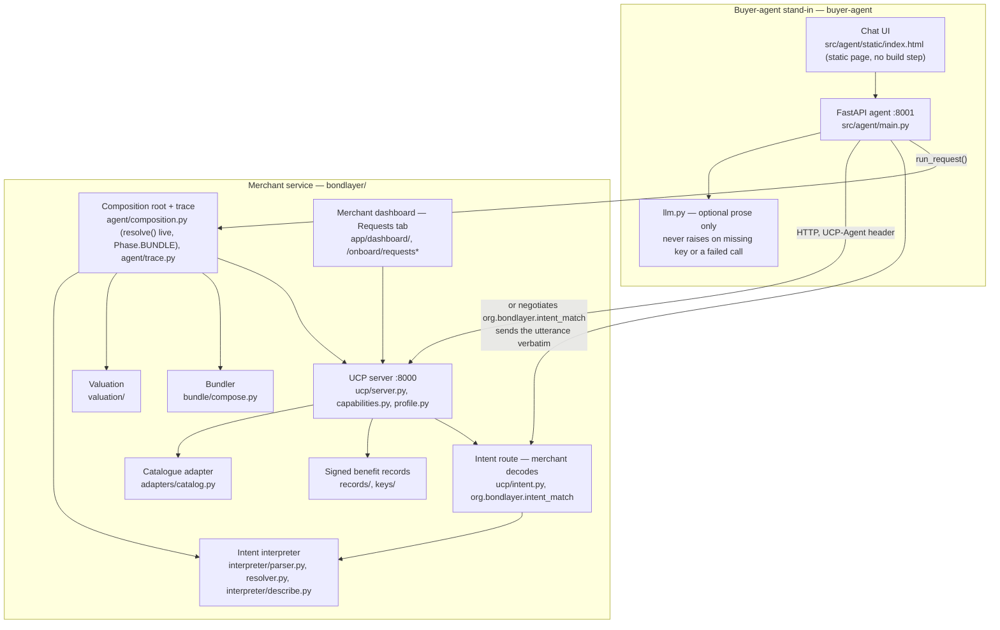

# System architecture

*Rewritten 12/09 evening to describe what exists, verified against the running code, not
the Day 1 plan. The earlier version of this file sketched a design before any of it was
built; that version is why `docs/notes/overview-progress.md` §2 records four open questions
about ownership (§3.1–3.4) that this rewrite closes by describing the code as it now stands.
Re-verified 13/09 against `round2/dev` at `339a7ed`, adding the intent path
(`org.bondlayer.intent_match`, `ucp/intent.py`) and the bundler (`bundle/compose.py`), both
of which landed after the evening rewrite; nothing else below changed.*

## Two applications, not five surfaces

The Day 1 plan (`bondlayer/WORKPLAN.md`) split the work across five owned surfaces (user
chat, merchant dashboard, console log). What actually shipped is **two applications**
sharing one core, matching `docs/notes/overview-progress.md` §2's re-cut:

## Component table, with real paths

| Component | What it is | Path | Owner (Round 2 branch) |
|---|---|---|---|
| Catalogue adapter | CSV in, normalised `Sku` + `Diagnostic` out, severity-scored | `bondlayer/src/bondlayer/adapters/catalog.py` | `feat/nguyen-ucp-head` |
| UCP head | Profile, capability negotiation, the three merchants, one response builder | `bondlayer/src/bondlayer/ucp/{profile,capabilities,server}.py` | `feat/nguyen-ucp-head` |
| Onboarding API | Merchant switcher, diagnostics report, catalog upload, `/onboard/requests*` serving `RequestReport` for the dashboard's Requests tab | `bondlayer/src/bondlayer/ucp/onboard.py` | `feat/nguyen-ucp-head`, `feat/minh-d2-dashboard` |
| Signed benefit records | `BenefitRecord`, ES256 detached signature over canonical JSON, verification | `bondlayer/src/bondlayer/records/`, `bondlayer/keys/`, `bondlayer/data/records/` | `feat/bach-records-signing` |
| Valuation | Effective-cost arithmetic: `credited = min(ceiling, shopper_policy_value)`, zero if unverified | `bondlayer/src/bondlayer/valuation/` | `feat/bach-records-signing` |
| Intent interpreter | Parses HARD/SOFT/SERVICE/VALUES clauses; `resolve()` runs on the live path and justifies each clause against catalogue attributes or verified records; `describe.py` renders the same decode as JSON | `bondlayer/src/bondlayer/interpreter/{parser,resolver,describe}.py` | `feat/hieu-interpreter`, `feat/hieu-d2-resolver`, `feat/hieu-d2-resolve-live` |
| Merchant-side intent route | `POST /{merchant}/ucp/intent/propose` — the merchant receives the utterance verbatim, decodes and resolves it on its own wire, returns `decoded_intent` + cited `proposals`; negotiated as `org.bondlayer.intent_match`, declared only by merchants that also publish the benefit extension | `bondlayer/src/bondlayer/ucp/intent.py` | `feat/ford-d2-intent-wire` |
| Bundler | Composes already-matched proposals from one merchant into a set with a togetherness rationale; never re-matches, never crosses merchants | `bondlayer/src/bondlayer/bundle/compose.py` | `feat/nguyen-d2-bundle` |
| Composition root + trace | Wires interpreter, merchants, valuation and the bundler into one request/response; renders the AI chain-of-thought trace, including `Phase.RESOLVE` and `Phase.BUNDLE` steps | `bondlayer/src/bondlayer/agent/{composition,trace}.py` | `feat/minh-console`, `feat/hieu-d2-resolve-live` |
| Merchant dashboard | Onboarding screen, readiness, a Requests tab rendering the four figures and "why we lost/won" per request | `bondlayer/app/dashboard/` (vendored React UMD, no build step) | `feat/nguyen-ucp-head`, `feat/minh-console`, `feat/minh-d2-dashboard` |
| Buyer-agent stand-in | FastAPI agent + a static chat page; calls `bondlayer`'s composition root over HTTP | `buyer-agent/src/agent/` | `feat/bach-records-signing`, `feat/bach`, `feat/bach-d2-one-demo` |
| Policy import | Merchant T&C prose → typed facts (envelope, records, conditions, provenance) behind a human approval gate | `bondlayer/src/bondlayer/policy.py` | `feat/hieu-interpreter` |

`src/bondlayer/types.py` is the shared contract every component above imports; it is not
edited on a feature branch (`bondlayer/README.md`, `bondlayer/WORKPLAN.md`).

## Five humans, and which branches they actually own

Per `docs/team.md` for the full name crosswalk. Branch names describe Day 1 origin, not
current content — see `docs/notes/README.md` "Day 1 branches → what they became" for the branch
→ code mapping and `docs/notes/overview-progress.md` §2 for why the names now disagree with the
work.

| Person | Round 2 scope, as it actually stands |
|---|---|
| Thanh Nha Phan | Data, taxonomy, eval set, catalogue, policy docs, market strategy, documentation, Problem Setter liaison |
| Hoang Manh Nguyen | Catalogue adapter, UCP head, capability negotiation, dashboard |
| Minh Hieu Tran | Intent interpreter (parser, then resolver), policy import |
| Thanh Bach Ly | Signed records, ES256 signing, valuation, buyer-agent stand-in |
| Ha Anh Minh Truong | Chat UI, console/trace rendering, dashboard UX |

## `Promotions` is `BenefitRecord`, not a separate type

An earlier version of this file listed three data models — Catalogs, Policy, Promotions —
with Promotions left undefined. `docs/notes/overview-progress.md` §3.4 flagged this as
undefined and unresolved; the resolution, settled on `types.py`, is that **there is no
separate `Promotions` type**. A promotion is a `BenefitRecord` with `benefit_type` drawn
from the same ontology (`member_price`, `points_earn`, `free_returns`, `warranty`,
`trade_in_credit`, `delivery`, plus the unpriced values types `repairability`,
`sustainability`, `durability`). It signs, expires and verifies through the one path every
other benefit record uses. Do not build a second signing or serving pipeline for
promotions; there is only ever one.

## What plain UCP and the extension both answer

`GET /{merchant}/ucp/catalog/search` and `…/lookup` are one route and one response builder
for every merchant. The `UCP-Agent` header determines what comes back:

- No `org.bondlayer.benefit_value` declared → plain, conformant UCP: `business`,
  `active_capabilities`, `products`. No `extensions` key at all — absent, not empty.
- `org.bondlayer.benefit_value` declared → the same response, plus an `extensions` block
  per product carrying its benefit records (signed or not, each tagged `signed: bool`).

CityCircuit is not a second implementation of this server; it is this server with the
extension absent from its manifest. That is what makes the control merchant honest — see
`bondlayer/README.md` "Where the extension attaches, and why."

## The intent path: decoding moves, deciding does not

`ucp/intent.py` adds a second route, `POST /{merchant}/ucp/intent/propose`, negotiated as its
own capability, `org.bondlayer.intent_match` (extends `catalog.search` only, declared by
exactly the merchants that also publish `org.bondlayer.benefit_value`). An agent that
negotiates it sends the shopper's utterance verbatim instead of a typed plan. The merchant
runs the same parser and the same resolver — `bondlayer.interpreter.{parser,resolver}` —
against its own catalogue and its own verified records, and returns `decoded_intent` (the
parsed clauses, what the catalogue cannot answer, and a clarifying question when nothing
names a product) plus `proposals` cited per clause to `evidence_record_id` /
`evidence_attribute`. `interpreter/describe.py` is what turns the resolver's own reading into
that JSON, so the wire's explanation and the resolver's behaviour cannot drift apart.

What still never crosses this wire: the shopper's valuation policy, its benefit weights, and
the cross-merchant comparison. The merchant proposes from its own shelf; ranking by effective
cost across merchants stays in `agent/composition.py`, exactly as it does for `catalog.search`.
An agent that declares `catalog.search` but not `intent_match` gets the publishing path only;
the control merchant declares neither the benefit extension nor `intent_match`, so it always
gets a 406 on this route.

`agent/composition.py`'s own `resolve()` seam runs the identical resolver on the agent side,
whether or not any merchant negotiated `intent_match` — `Phase.RESOLVE` in the trace reports
how many of the request's constraints the shelf answered and how many needed a verified
record, on every request, not only ones sent through the intent route.

## The bundler: composition, never a second match

`bundle/compose.py` implements `Bundler.compose(constraints, proposals) -> list[Bundle]`
(the `Bundler` protocol on `types.py`). It runs strictly after the resolver and the ranking in
`agent/composition.py`, and it never re-matches: every item in a bundle is a proposal the
resolver already justified, kept with its own `ResolvedConstraint` notes. Its only decision is
which already-matched items belong *together*, from one merchant, never crossing a merchant
boundary. A bundle of one item is the valid degenerate case when nothing on the shelf
complements the best match. Served as `bundles[]` inside the benefit extension block on
`catalog.search`, and as a `Phase.BUNDLE` step in the trace and the chat app.

## Not modelled here

A settlement-grade checkout and the negotiation/counter-offer protocol are covered in the
root `README.md`'s "Deliberately not attempted" section, which is the current source for
what shipped versus what did not. Dynamic bundling is no longer in that list — it shipped,
as described above.
