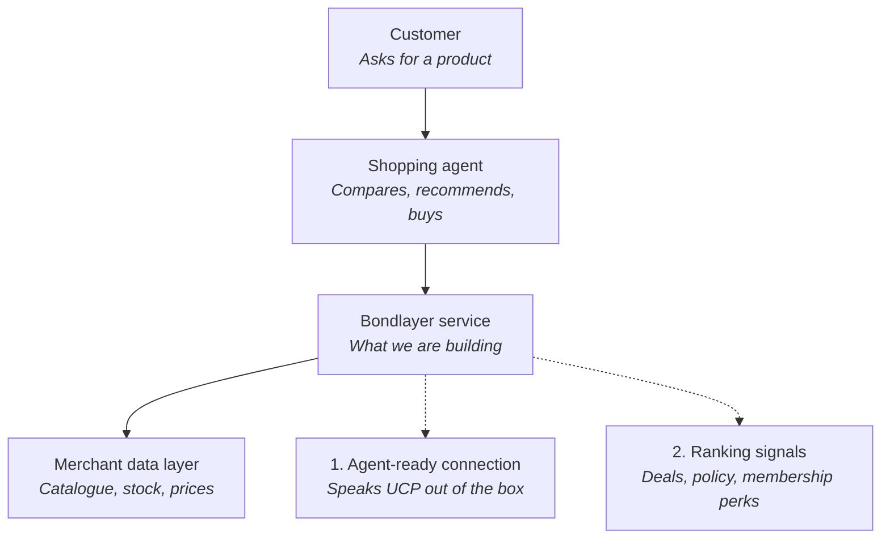
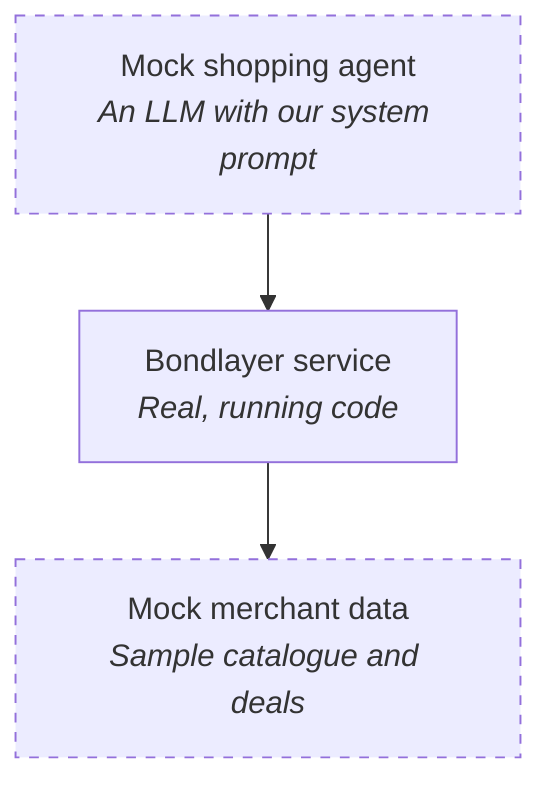

# Bondlayer — plain-language summary

## The short version

People are starting to shop through AI assistants instead of browsing shops themselves. You tell an assistant "find me a good waterproof jacket under $200," and it goes off, compares options, and comes back with a pick. This is the shift people are calling **B2AI — Business to AI**: your customer is increasingly a robot doing the shopping on a human's behalf.

That creates a new problem for merchants. Your website can be beautiful, your reviews can be great, but if the AI can't read your catalogue in the format it expects, you simply don't show up. And even if you do show up, you're now one row in a comparison table — the agent picks whoever looks best on the facts it can see.

So merchants need two things: **be visible to the agents**, and **be the one the agent picks**.

## What we're building: Bondlayer

Bondlayer is a middle layer that sits between the shopping agent and the merchant's own systems. The merchant plugs it in once; from then on, any shopping agent can talk to them properly.

**Feature 1 — the plug.** Bondlayer implements UCP, the emerging standard language shopping agents use to browse and buy. Instead of every merchant building their own integration for every agent, they connect to Bondlayer once and are instantly readable by any agent that speaks the standard. Think of it as a universal adapter for the AI shopping era.

**Feature 2 — the pitch.** This is the part that makes us more than plumbing. A raw product feed only gives the agent a name, a price, and a photo. Bondlayer also feeds it the things that actually win a sale: current deals and bundles, return and warranty policy, shipping speed, and membership or loyalty benefits. When an agent compares five near-identical jackets, the one with "free returns, 2-day shipping, extra 10% for members" is the one it recommends. Same product, better answer — because the agent finally has the full story.

In short: feature one gets you into the race, feature two helps you win it.

## How the demo works

We can't ship a real consumer shopping agent in a hackathon, and we don't have a real merchant's live database. So we build the middle honestly and simulate the two ends.

*Dashed = simulated for the demo. Solid = what we actually built.*

The stand-in shopping agent is a language model given a system prompt that tells it to behave like a real one: take the shopper's request, query the merchants, compare what comes back, and recommend a winner. It has no special knowledge of us — it just does what a shopping agent does.

The merchant data is a sample catalogue with a handful of competing products, so we control the comparison and can show a clean result on stage.

Everything in between is the actual product. The judges see a real request go through real Bondlayer code and come back with a real answer.

**The money shot of the demo** is a before-and-after. Run the same shopper request twice: once against a plain product feed, once through Bondlayer. In the first run our merchant is buried in the middle of the pack. In the second, the agent has the deals, the policy, and the membership perks, and recommends our merchant — and explains why in its own words. Same product, same price, different outcome. That's the whole value proposition in about thirty seconds.

---

## A note on the word "agent"

*Added 01/09/2026, while preparing Round 2.*

The two diagrams above originally labelled our box **"Bondlayer agent"**. That
is the wording in the Round 1 submission (see the pitch PDF beside this file),
and it contradicted this document's own prose, which describes a *middle layer*,
a *plug*, a *universal adapter*, something that *implements UCP*, *feeds* data
and is *readable*. Every one of those is a publishing layer. None of them is an
agent.

The labels now say **service**, because that is what the code is: a merchant-side
UCP server plus a signed extension. It holds no state per shopper, makes no
decision, and returns the same published facts to every caller.

**This is a position, not an apology.** A publishing layer has no
per-comparison latency budget, no real-time dependency at the moment of
decision, and no privacy story to defend — because the merchant never learns it
was compared. The agentic version is designed and deliberately deferred; what it
would cost is written up in the Round 1 spike document
`archive/pre-hackathon-spikes/bach-demo/docs/deferred-retention-engine.md`
(removed from the tree on 13/09; in git history at commit `074e51c`).

> In a room full of agents, we are building the thing agents read.
