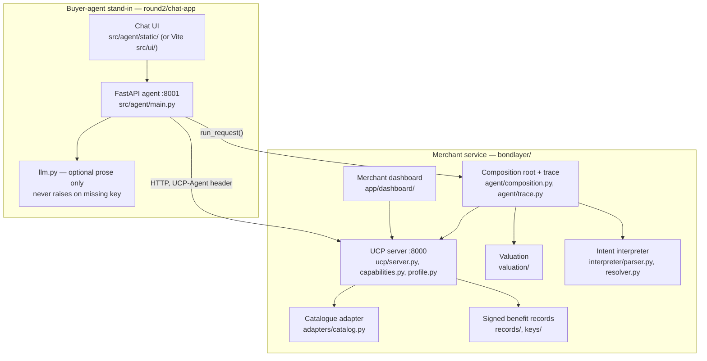

# System architecture

*Rewritten 12/09 evening to describe what exists, verified against the running code, not
the Day 1 plan. The earlier version of this file sketched a design before any of it was
built; that version is why `round2/overview-progress.md` §2 records four open questions
about ownership (§3.1–3.4) that this rewrite closes by describing the code as it now stands.*

## Two applications, not five surfaces

The Day 1 plan (`bondlayer/WORKPLAN.md`) split the work across five owned surfaces (user
chat, merchant dashboard, console log). What actually shipped is **two applications**
sharing one core, matching `round2/overview-progress.md` §2's re-cut:

## Component table, with real paths

| Component | What it is | Path | Owner (Round 2 branch) |
|---|---|---|---|
| Catalogue adapter | CSV in, normalised `Sku` + `Diagnostic` out, severity-scored | `bondlayer/src/bondlayer/adapters/catalog.py` | `feat/nguyen-ucp-head` |
| UCP head | Profile, capability negotiation, the three merchants, one response builder | `bondlayer/src/bondlayer/ucp/{profile,capabilities,server}.py` | `feat/nguyen-ucp-head` |
| Onboarding API | Merchant switcher, diagnostics report, catalog upload | `bondlayer/src/bondlayer/ucp/onboard.py` | `feat/nguyen-ucp-head` |
| Signed benefit records | `BenefitRecord`, ES256 detached signature over canonical JSON, verification | `bondlayer/src/bondlayer/records/`, `bondlayer/keys/`, `bondlayer/data/records/` | `feat/bach-records-signing` |
| Valuation | Effective-cost arithmetic: `credited = min(ceiling, shopper_policy_value)`, zero if unverified | `bondlayer/src/bondlayer/valuation/` | `feat/bach-records-signing` |
| Intent interpreter | Parses HARD/SOFT/SERVICE/VALUES clauses; resolves against catalogue attributes and verified records | `bondlayer/src/bondlayer/interpreter/{parser,resolver}.py` | `feat/hieu-interpreter`, `feat/hieu-d2-resolver` |
| Composition root + trace | Wires interpreter, merchants and valuation into one request/response; renders the AI chain-of-thought trace | `bondlayer/src/bondlayer/agent/{composition,trace}.py` | `feat/minh-console` |
| Merchant dashboard | Onboarding screen, readiness, per-request "why we lost" | `bondlayer/app/dashboard/` (vendored React UMD, no build step) | `feat/nguyen-ucp-head`, `feat/minh-console` |
| Buyer-agent stand-in | FastAPI agent + chat UI; calls `bondlayer`'s composition root over HTTP | `round2/chat-app/src/agent/` | `feat/bach-records-signing`, `feat/bach` |
| Policy import | Merchant T&C prose → typed facts (envelope, records, conditions, provenance) behind a human approval gate | `bondlayer/src/bondlayer/policy.py` | `feat/hieu-interpreter` |

`src/bondlayer/types.py` is the shared contract every component above imports; it is not
edited on a feature branch (`bondlayer/README.md`, `bondlayer/WORKPLAN.md`).

## Five humans, and which branches they actually own

Per `docs/team.md` for the full name crosswalk. Branch names describe Day 1 origin, not
current content — see `round2/README.md` "Day 1 branches → what they became" for the branch
→ code mapping and `round2/overview-progress.md` §2 for why the names now disagree with the
work.

| Person | Round 2 scope, as it actually stands |
|---|---|
| Thanh Nha Phan | Data, taxonomy, eval set, catalogue, policy docs, market strategy, documentation, Problem Setter liaison |
| Hoang Manh Nguyen | Catalogue adapter, UCP head, capability negotiation, dashboard |
| Minh Hieu Tran | Intent interpreter (parser, then resolver), policy import |
| Thanh Bach Ly | Signed records, ES256 signing, valuation, buyer-agent stand-in |
| Ha Anh Minh Truong | Chat UI, console/trace rendering, dashboard UX |

## `Promotions` is `BenefitRecord`, not a separate type

An earlier version of this file listed three data models — Catalogs, Policy, Promotions —
with Promotions left undefined. `round2/overview-progress.md` §3.4 flagged this as
undefined and unresolved; the resolution, settled on `types.py`, is that **there is no
separate `Promotions` type**. A promotion is a `BenefitRecord` with `benefit_type` drawn
from the same ontology (`member_price`, `points_earn`, `free_returns`, `warranty`,
`trade_in_credit`, `delivery`, plus the unpriced values types `repairability`,
`sustainability`, `durability`). It signs, expires and verifies through the one path every
other benefit record uses. Do not build a second signing or serving pipeline for
promotions; there is only ever one.

## What plain UCP and the extension both answer

`GET /{merchant}/ucp/catalog/search` and `…/lookup` are one route and one response builder
for every merchant. The `UCP-Agent` header determines what comes back:

- No `org.bondlayer.benefit_value` declared → plain, conformant UCP: `business`,
  `active_capabilities`, `products`. No `extensions` key at all — absent, not empty.
- `org.bondlayer.benefit_value` declared → the same response, plus an `extensions` block
  per product carrying its benefit records (signed or not, each tagged `signed: bool`).

CityCircuit is not a second implementation of this server; it is this server with the
extension absent from its manifest. That is what makes the control merchant honest — see
`bondlayer/README.md` "Where the extension attaches, and why."

## Not modelled here

Dynamic bundling (`Bundler`), a settlement-grade checkout, and the negotiation protocol are
covered in the root `README.md`'s "Deliberately not attempted" section, which is updated
later in the freeze sequence and is the current source for what shipped versus what did not.
